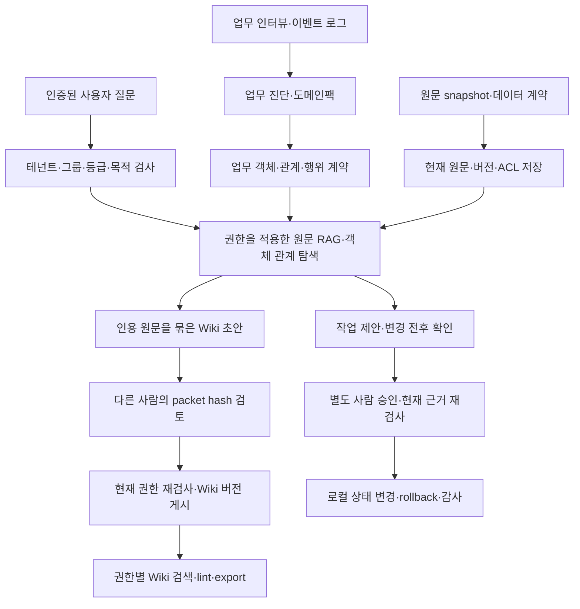

# AX Ontology Starter

**업무 진단 → 온톨로지·원문 RAG → 검토된 LLM Wiki → 승인된 작업 실행**을 연결하는, 여러 업종에 맞춰 확장할 수 있는 AX 스타터팩입니다.

업무의 입력·판단·인계·예외·승인·산출물을 정리한 뒤, 업무 객체와 근거를 연결하고 사람이 승인한 작업을 실행하는 로컬 참조 구현입니다. 구매, 고객지원, 입사서류 점검의 합성 예제를 제공합니다. 실제 회사 업무는 도메인팩과 평가셋을 추가하면서 확장합니다.

현재 버전은 **v0.3.0 로컬 참조 구현**입니다. 원문은 근거를 확인하고, 온톨로지는 업무 객체와 관계를 연결하며, Wiki는 여러 원문의 업무 지식을 사람이 검토해 버전으로 축적합니다. 회사별 도입 진단, 서버 등록 신원에 연결하는 JWT 검증, 데이터 계약·ACL·삭제, 평가 기반 현업 검토 조건도 포함합니다. Palantir의 공식 객체·관계·행위·접근 정책과 OAG 개념을 참고했으며, Palantir 공식 제품이나 Foundry 연결 구현은 아닙니다. 현재 검색은 권한을 먼저 적용하는 키워드 + 그래프 방식입니다.

| 처음 확인할 것 | 안내 |
|---|---|
| 실행 가능한 범위 | Python CLI·인증 API·SQLite 저장소, 구매·고객지원·입사서류 점검 합성 데모 |
| 확인된 검증 | 421개 테스트, 린트·타입 검사, 설치본·이전 DB 검사, 독립 Sol 검토와 실제 Opus 5.5 정적 감사 |
| 회사 적용 전 확인 | [v0.3 전달 결과와 알려진 권고 8개](docs/V03_RELEASE.md) |
| 바로 받아 실행 | [v0.3.0 릴리즈](https://github.com/tttksj404/ax-ontology-starter/releases/tag/v0.3.0) 또는 아래 clone 명령 |
| 검증 범위와 이력 | [실행 검증 보고서](docs/V03_VERIFICATION.md), [GitHub 게시 범위](docs/GITHUB_GUIDE.md) |

서버·네트워크가 있어도 회사별 신원, 데이터 계약, 반출 정책, 업무 책임자, 현업 평가셋은 연결해야 합니다. 합성 데모의 성공은 실제 회사 배포·보안 인증·모델 품질·ROI를 입증하지 않습니다.

현재 Wiki는 요청당 page 하나, page당 raw 원천 최대 10개만 compile합니다. Wiki→Wiki synthesis, source watcher와 자동 재compile queue는 없습니다. 모든 원천과 anchor·hop 객체의 현재 접근권한을 AND로 요구하므로 원천이 늘수록 독자층이 줄며, 기본 floor는 RESTRICTED입니다. 변경이 잦고 ACL이 세밀한 개별 인사·고객 사건보다 변경이 드문 규정·용어·절차에 먼저 적용합니다. 자세한 계약은 [LLM Wiki 가이드](docs/LLM_WIKI_GUIDE.md)에 있습니다.

## 무엇을 얻는가

| 구성 | 실제 제공 기능 |
|---|---|
| 업무 진단 | 단계·선행 관계·책임자·규칙·예외·민감도·통제 지점을 분석하고 보류/보조/승인 필요/자동화 후보를 구분 |
| 회사별 도입 판단 | 배치·반출·지역·모델·도구·보존·접근 정책과 책임자·근거·승인의 누락 또는 충돌을 이유 코드로 반환 |
| 전체 흐름 측정 | 이벤트 로그에서 대기·작업·인계·반복 방문·처리 구간을 계산; 추정 ROI와 실측을 구분 |
| 온톨로지 | 타입·속성·객체·관계·문서·행위 계약, JSON Schema, 선언형 업종팩 |
| 근거 검색 | 테넌트·그룹·민감도·사용 목적을 검색 전에 검사, 유효기간·원문·버전·해시를 인용 |
| LLM Wiki | 원문에서 초안 생성 → 서로 다른 사람의 hash 검토 → 버전 게시; 권한별 index·backlink·검색·lint·Markdown export, 모든 모델 입력 원문 결속 |
| 지식 수명주기 | 운영자가 등록한 계약으로 파일 snapshot 가져오기, 문서 갱신·폐기·논리 삭제·ACL 변경; 리비전 충돌·중복 요청·재시작 검증 |
| 기업 신원 연결 | 고정된 공개 JWKS로 RS256 접근토큰 검증, 발급자·audience·만료·키 회전 확인; 실제 권한은 서버 Principal에서 결정 |
| 실행 통제 | 제안 → 변경 전후 확인 → 별도 사람 승인 → 실행 → 되돌리기 → 해시 체인 감사 |
| AI 선택 | 모델 없이 검색, 같은 장비의 로컬 Ollama, HTTPS 사내/클라우드 게이트웨이 설정 |
| 심화 경로 | 실데이터 연결·분야 용어·하이브리드 검색·평가·운영·제한 자동화의 단계별 진입/종료 조건 |
| 평가와 진입 조건 | 품질·거부·지연·비용의 기준선 비교, 권한 위반·안전 실패·삭제 누락의 즉시 차단; 합성 결과는 현업 검증으로 승격하지 않음 |

실행되는 쓰기는 SQLite의 **로컬 검토 상태** 변경 하나입니다. ERP 발주, 환불, 급여, 채용 결정, 설비 제어를 실제로 수행하는 커넥터는 포함하지 않습니다. 업무 진단의 `automate_candidate`는 개발·검증 우선순위이며, 실행 엔진의 승인 요구를 해제하지 않습니다.

업무 발굴 인터뷰를 구조화 JSON으로 확인한 뒤 진단합니다. 업종별 데이터 계약·도메인팩·현업 평가셋을 만드는 기존 도입 절차는 [회사 적용 가이드](docs/V02_GUIDE.md), Wiki 실행과 검토 절차는 [v0.3 가이드](docs/V03_GUIDE.md), 설계 판단과 분야별 강화 방법은 [LLM Wiki 가이드](docs/LLM_WIKI_GUIDE.md)에 있습니다.

## RAG·온톨로지·Wiki가 함께 움직이는 방식

RAG는 질문 시점에 접근 가능한 현재 원문을 찾고, 온톨로지는 그 원문을 업무 객체와 관계에 연결합니다. Wiki는 원문에서 만든 초안을 다른 사람이 검토한 뒤 재사용 가능한 절차·용어·예외 지식으로 게시합니다. 작업 실행은 현재 원문 근거와 별도의 사람 승인을 다시 확인합니다. Wiki의 파생 지식을 원천 문서나 작업 승인 근거로 자동 승격하지 않습니다.



원문이 바뀌거나 만료·폐기·삭제되거나 권한이 회수되면 그 원문에 의존한 Wiki의 가시성을 다시 검사합니다. 자동 재생성은 제공하지 않으며, 운영자가 lint 결과를 확인하고 새 초안을 검토·게시합니다. 실제 흐름과 모듈 해부는 [학습 가이드](docs/LEARNING_GUIDE.md)와 [Wiki 가이드](docs/LLM_WIKI_GUIDE.md)에 있습니다.

## 어디에 적용하고 어떻게 강화하는가

공통 코어는 업종을 바꾸어 재사용하고, 업무 용어·객체·관계·행위·원천 계약·평가셋은 도메인팩으로 추가합니다. **현재 실행 예제가 있는 업종은 구매·고객지원·인사 3개**이며, 나머지는 회사 데이터와 커넥터를 구현해 적용하는 확장 범위입니다.

| 업무 | 스타터에서 확인할 수 있는 적용 단위 | 회사에서 추가할 것 |
|---|---|---|
| 구매·조달 | 요청·규정 근거 검색, 검토 상태 변경 | 공급사·ERP·결재 계약, 실제 발주 통제 |
| 고객지원 | 문의·정책 확인, 검토 절차 | CRM·티켓 연계, 고객정보 분류, 답변 평가 |
| 인사·입사서류 | 서류·규정 점검, 검토 절차 | 사내 권한·보존 정책, 개인정보 검토 |
| 제조·정비 | 자산·고장·작업지시 관계로 팩 확장 | CMMS·현장 데이터 커넥터, 안전 통제 |
| 금융·공공·법무 | 규정·증빙·검토 흐름으로 팩 확장 | 기관별 법·정책 검토, 결정 엔진, 별도 승인 |

금전 이동, 채용 결정, 의료 판단, 설비 제어 같은 중요한 결정은 회사의 검증된 결정·업무 시스템과 책임자에게 연결해야 합니다. 이 저장소에는 해당 실운영 커넥터가 없습니다.

| 단계 | 강화 목표 | 다음 단계로 넘어가기 위한 증거 |
|---|---|---|
| L0 | 업무 범위·출처·권한·용어 정리 | 책임자·데이터 계약·기준선 |
| L1 | 분야별 절차·예외·Wiki 검토 | 독립 게시와 권한·만료·삭제 회귀 |
| L2 | 검색·모델·RAG/Wiki 조합 비교 | 숨긴 회사 gold set의 품질·지연·비용 비교 |
| L3 | 변경 감지·검토 대기열·운영 복구 강화 | 장애·권한 회수·복구·삭제 검증 |
| L4 | 검증된 좁은 업무의 실행 연계 | 안전 조건·현업 승인·감사·rollback |

L3의 source watcher·자동 재compile queue와 실업무 실행 커넥터는 향후 구현 항목입니다. 단계마다 평가와 승인 조건을 통과하며, [업그레이드 가이드](docs/UPGRADE_GUIDE.md)와 [회사 gold set 서식](templates/wiki/company-gold-set.md)으로 구체화합니다.

## 바로 실행

Python 3.12와 [uv](https://docs.astral.sh/uv/)가 필요합니다. Windows PowerShell 기준이며, GitHub에서 처음 가져올 때는 다음 명령을 먼저 실행합니다. 릴리즈 ZIP을 받은 경우에는 압축을 푼 프로젝트 폴더로 이동합니다.

```powershell
git clone https://github.com/tttksj404/ax-ontology-starter.git
Set-Location ax-ontology-starter
```

```powershell
[Console]::OutputEncoding = [Text.UTF8Encoding]::new($false)
$OutputEncoding = [Text.UTF8Encoding]::new($false)
$env:PYTHONIOENCODING = 'utf-8'
uv sync --frozen
uv run ax demo --domain procurement
uv run ax demo --domain support
uv run ax demo --domain hr
uv run ax wiki demo --domain procurement
uv run ax wiki demo --domain support
uv run ax wiki demo --domain hr
```

각 데모는 새 임시 DB에서 진단, 근거 검색, 독립 승인, 중복 실행 방지, 되돌리기, 감사 검증을 끝내고 `passed: true`를 반환합니다. 모델 비용과 API 키 없이 실행됩니다.

`wiki demo`는 별도의 합성 시나리오입니다. 원문 추출 초안의 독립 게시, 원문 인용, 재시작 후 복원, 원문 만료에 따른 숨김을 실행하고 각각의 boolean을 반환합니다. `model_executed=false`이며 실제 모델 품질이나 회사 ROI를 측정하지 않습니다.

```powershell
uv run ax init .runtime\company-pilot --domain procurement
uv run ax onboard evaluate .runtime\company-pilot\onboarding-request.json
uv run ax assess .runtime\company-pilot\intake.json
uv run ax process .runtime\company-pilot\process-log.json
uv run ax pack validate .runtime\company-pilot\domain-pack.json
uv run ax pack eval .runtime\company-pilot\domain-pack.json .runtime\company-pilot\identities.json .runtime\company-pilot\evaluation-set.json
```

`init`은 새 폴더만 허용하며 운영체제 접근 권한을 현재 사용자로 제한합니다. `demo-credentials.json`은 로컬 합성 데모 전용입니다. 키 값을 터미널에 출력하거나 Git에 넣지 마세요. 기업 인증을 대신하지 않습니다.

초기 `onboarding-request.json`의 근거·승인은 `unknown`입니다. 진단 JSON을 반환하고 종료 코드 2로 보완을 요구하는 것이 정상 동작입니다. 회사 담당자가 정책과 증거를 채운 뒤 다시 평가합니다. 이 진단은 서버의 실행 권한을 변경하지 않습니다.

JSON을 읽는 CLI는 기본적으로 현재 작업 폴더 안의 로컬 파일만 받습니다. 다른 회사 폴더를 사용할 때는 `AX_INPUT_ROOT`를 해당 로컬 폴더로 지정합니다. UNC·장치 경로·ADS·심볼릭 링크·Windows reparse 경로와 허용 폴더 밖의 입력은 파일을 열기 전에 차단합니다.

## 인증 API 실행

<details>
<summary>로컬 파일럿의 인증 API와 원문 관리 명령 펼치기</summary>

먼저 위의 `ax init`으로 파일럿 폴더를 만들고 실행합니다. Wiki 검토·게시 명령은 [v0.3 실행 가이드](docs/V03_GUIDE.md)를 사용합니다.

```powershell
$taskPilot = (Resolve-Path .runtime\company-pilot).Path
$env:AX_PACK_FILE = Join-Path $taskPilot 'domain-pack.json'
$env:AX_AUTH_FILE = Join-Path $taskPilot 'identities.json'
$env:AX_PROVIDER_FILE = Join-Path $taskPilot 'provider.json'
$env:AX_DATA_CONTRACTS_FILE = Join-Path $taskPilot 'data-contracts.json'
$env:AX_DB_FILE = Join-Path $taskPilot 'state.db'
uv run uvicorn ax_starter.runtime:load_app --factory --host 127.0.0.1 --port 8000 --no-access-log
```

다른 PowerShell 창에서 같은 프로젝트로 이동합니다.

PowerShell 5에서 JSON 출력을 파이프로 읽는 창에도 위 UTF-8 설정을 적용합니다. 한글 리터럴이 들어 있는 `.ps1`을 저장해 실행한다면 UTF-8 BOM으로 저장하거나 PowerShell 7을 사용합니다.

```powershell
$taskCredentials = Get-Content .runtime\company-pilot\demo-credentials.json -Raw -Encoding UTF8 | ConvertFrom-Json
$env:AX_TOKEN = ($taskCredentials.credentials | Where-Object subject -eq 'operator').token
uv run ax ask '검토 절차' --object-id request-1
```

질문·역할·권한을 요청 본문에서 임의로 주입할 수 없습니다. `/health` 외의 API에는 Bearer 인증이 필요합니다. 승인 명령, 실제 HTTP 요청 예제와 운영 방법은 [운영 가이드](docs/OPERATIONS.md)에 있습니다.

데모 인증의 기본 모드는 `opaque_only`입니다. 기업 접근토큰을 연결할 때는 운영자가 `jwt_only` 또는 `both`를 명시하고 발급자·공개키·클라이언트·사용자/서비스 매핑을 등록합니다. 승인에는 사람이 필요하며 제안자와 같은 사람의 다른 계정도 사용할 수 없습니다. 제안·승인 당시 신원과 현재 신원이 달라지면 미완료 작업을 차단합니다.

문서를 관리할 때는 별도 `steward` 데모 계정을 사용합니다. 이 계정에는 업무 승인·실행 권한이 없습니다.

```powershell
$env:AX_TOKEN = ($taskCredentials.credentials | Where-Object subject -eq 'steward').token
uv run ax contract validate .runtime\company-pilot\data-contracts.json
uv run ax knowledge state
uv run ax knowledge import .runtime\company-pilot\source-snapshot.json
uv run ax knowledge state
```

같은 요청은 원래 영수증 기록을 재사용합니다. 응답의 `documents`는 현재 권한과 계약에 맞춰 투영하므로 권한 회수 이후에는 줄어들 수 있으며 저장된 원본 기록은 유지합니다. 다음 변경에는 `knowledge state`의 tenant/source 리비전을 사용해야 하며, 새 snapshot의 관측 시각은 계약 갱신 주기 안에 있어야 합니다. `import`에는 변경된 문서만 넣고, 변경 문서는 과거에 수락한 적 없는 새 `source_version`을 사용합니다. 중복 문서 ID는 API 422 또는 CLI `invalid_input_file`로 거부하며, snapshot에서 빠진 문서를 자동 삭제하지 않습니다. 실제 원천 접근·ACL 수집·출처 인증은 회사 커넥터에서 별도로 구현합니다. `tombstone`은 primary SQLite의 논리 레코드에서 본문을 제거하며 디스크·백업의 완전한 삭제를 증명하지 않습니다.

새 관측 시각은 원천의 이전 관측보다 늦어야 하며 과거 문서 버전은 재사용할 수 없습니다. 계약의 버전·해시가 바뀌면 기존 managed 문서가 검색과 승인 근거에서 제외됩니다. 같은 계약 아래 새 원천 버전으로 명시적으로 재등록해야 합니다.

`knowledge state`의 문서 목록은 호출자의 문서 접근권한과 관리 가능한 현재 계약으로 제한됩니다. 폐기·논리 삭제 후에도 직전 ACL을 적용하며, ACL을 복원할 수 없는 기존 메타데이터는 숨깁니다. tenant 리비전·해시와 허용된 source head는 변경 충돌 방지를 위한 집계 상태이므로 이 응답을 회사 전체 자산 목록으로 해석해서는 안 됩니다.

기존 문서의 갱신·폐기·ACL 변경·논리 삭제는 저장된 ACL의 tenant·그룹·등급도 검사합니다. 문서의 사용 목적 제한은 관리 작업의 이 검사에서 제외하며, 상태·영수증 목록에는 감사 목적의 가시성을 계속 적용합니다. 계약 버전·해시가 바뀐 문서도 같은 tenant/source/contract ID 아래에서는 중간 재게시 없이 `tombstone`할 수 있습니다. 관리 문서의 신규 입력과 ACL 변경에서 빈 `groups`는 422로 거부합니다. 이미 존재하는 빈 ACL·복원 불가능한 ACL은 숨김과 404를 유지하므로 담당자가 통제된 migration으로 정리해야 합니다.

관리 문서 upsert ID는 `tenant.접미부` 형식이며 마지막 점 앞의 문자열이 계약 tenant와 정확히 같고 접미부에는 점이 없어야 합니다. 다른 회사의 ID는 존재 여부에 관계없이 422로 거부합니다. 같은 회사 안에서는 새 ID 생성 결과로 기존 ID의 존재를 추론하거나 선점할 수 있으므로 민감한 의미를 ID에 넣지 않고 신뢰하는 발급자와 계약별 할당 범위를 사용합니다. 기존 비정규 ID는 자동으로 바꾸지 않으며 현재 권한·계약에 맞는 retire/tombstone 정리를 유지합니다. 다중 tenant 도입 전에 legacy·bootstrap ID의 실제 소유자와 prefix 충돌을 대조하고, 다른 tenant의 namespace를 점유하는 과거 ID는 통제된 migration으로 정리합니다.

지식 관리자는 계약이 허용하는 범위 안에서 그룹·목적·등급의 ACL을 확대하거나 축소할 수 있습니다. 이 권한은 본문 접근을 새로 부여할 수 있으므로 회사 담당자가 위임 범위를 확인해야 합니다. 데이터 계약을 registry에서 제거하면 해당 문서의 일반 삭제 경로도 차단됩니다. 제거 전에 보존·삭제를 정리하거나, 같은 tenant/source/contract ID로 재등록한 뒤 명시적으로 tombstone합니다.

</details>

## 보안 수준별 AI

| 모드 | 예제 정책 상한 | 연결 방식 | 필요한 회사 측 확인 |
|---|---|---|---|
| `offline` | 모델 전송 없음 | 결정적 근거 검색 | 데이터와 사용자 권한 |
| `local` | 제한정보까지 | 같은 장비의 loopback IP 모델 API | backend 원격 forwarding·cloud model·proxy/tunnel 차단, 로컬 모델 라이선스·품질·모델 파일·장비 보호 |
| `private_gateway` | 기밀까지 | 정확한 허용 호스트의 HTTPS, OpenAI 호환 API | 폐쇄망/전용망, 공급자 계약, 보관·리전·하위 처리자 |
| `cloud_gateway` | 공개·내부까지 | 회사가 승인한 HTTPS 게이트웨이 | 반출 승인, 분류·DLP, 학습·보관 조건, 비용·쿼터 |

상한은 이 참조 구현의 보수적 정책 예시이며 회사 규정으로 확정해야 합니다. 외부 모드는 기본적으로 `egress_approved=false`입니다. 게이트웨이는 개인정보 검토나 데이터 보관 계약을 대신하지 않습니다. 모델 연결에 실패하면 다른 클라우드로 자동 우회하지 않습니다. loopback은 첫 hop만 제한하므로 LOCAL을 오프라인 추론 보장으로 해석하지 않습니다. 무반출이 필요하면 OS/container outbound deny, DNS·proxy·tunnel 차단과 실제 패킷 검증을 추가합니다.

미분류 질문의 서버 측 기본 등급은 `RESTRICTED`여서 외부 모드의 전송을 차단합니다. 사용자가 질문을 공개로 표시해도 이 하한은 낮아지지 않습니다. 운영자는 입력 채널의 분류 통제와 회사 반출 정책을 검증한 뒤에만 `minimum_query_sensitivity`를 조정해야 합니다.

설정 템플릿은 [examples/providers](examples/providers)에 있습니다. 생성 응답은 인용 원문을 검사해도 항상 사람이 검토해야 하는 초안입니다. 본문 의미 전체의 정확성이 자동 증명되지는 않습니다. 실제 LLM 운영체 연결은 회사 환경에서 별도로 시험해야 합니다.

## 회사에 맞추는 순서

1. [적용 범위와 업무 인터뷰](docs/ADOPTION.md)로 책임자, 데이터 권한, 업무 전체 흐름과 기준선을 정합니다.
2. [구조와 계약](docs/ARCHITECTURE.md)에 따라 `domain-pack.json`, `intake.json`, `evaluation-set.json`을 작성합니다.
3. [심화·업그레이드 가이드](docs/UPGRADE_GUIDE.md)의 단계별 평가와 승인 조건을 통과합니다.
4. [보안 모델](docs/SECURITY_MODEL.md)과 [운영 가이드](docs/OPERATIONS.md)에 있는 실제 인프라 조건을 충족한 뒤 제한 파일럿을 진행합니다.

기업별 운영 형태를 참고한 근거는 [기업 사례](docs/ENTERPRISE_PATTERNS.md)와 [공식 자료 목록](docs/SOURCE_CATALOG.md), 코드의 실제 상호작용과 확장 실습은 [학습 가이드](docs/LEARNING_GUIDE.md)에 있습니다. 이전 버전의 검증과 모델 협업 기록은 [v0.1 검증 보고서](docs/VERIFICATION.md)에 보존했습니다.

현재 Wiki 확장의 실행·설치·이전 DB·독립 검토 증거와 남은 경계는 [v0.3 검증 보고서](docs/V03_VERIFICATION.md)에 기록합니다.

평가 추천은 pack·데이터 계약·모델·프롬프트·정책·case set·rubric·코드의 선언 버전과 해시에 결합합니다. 실제 전달 기준·fixture 집합의 digest를 대조하고 중복 case ID를 거부합니다. 추천은 현업 검토 입력이며 외부 증거의 진위나 production 승인을 뜻하지 않습니다.

## 개발 검증

전체 기본 검사를 한 번에 실행합니다. 코드 변경 뒤에는 설치본·이전 DB·관련 보안 회귀도 변경 범위에 맞게 확인합니다.

```powershell
powershell.exe -NoProfile -ExecutionPolicy Bypass -File scripts/check.ps1
powershell.exe -NoProfile -ExecutionPolicy Bypass -File scripts/check-delivery.ps1
```

개별 검사 명령은 다음과 같습니다.

```powershell
uv run --frozen pytest -q
uv run --frozen basedpyright
uv run --frozen ruff check src tests
uv run --frozen ruff format --check src tests
uv build
```

설정·데이터 팩을 새 폴더에 다시 내보내려면 `uv run ax assets <새폴더>`를 사용합니다. 기존 폴더는 덮어쓰지 않습니다. 민감정보와 자격증명은 내보내지 않습니다.

## 검증 결과를 읽는 방법

2026-10-06 revision-3의 실행 결과는 **421개 테스트 통과**, Ruff ALL, Python 145개 파일 format 통과, basedpyright 오류·경고 0입니다. 실제 wheel 설치 후 runtime 70개 모듈의 바이트를 대조하고, HTTP·CLI·재시작·원문/Wiki 수명주기와 v0.2 DB 이전을 검증했습니다. [고정 검사 소스와 실행 로그](docs/evidence/v0.3.0/revision-3/verification-index.json)에서 범위를 확인할 수 있습니다.

독립 Sol 검토와 **실제 Claude Opus 5.5의 정적 감사**는 PASS였으며, Opus는 `--effort max`로 호출했습니다. 응답의 모델명과 호출 인수·입력 hash를 구분해 기록했고, 정적 감사를 실행 시험으로 표현하지 않습니다. [최종 Opus 공개 기록](docs/evidence/v0.3.0/revision-3/final-audit-public.json)에는 비차단 권고 8개가 남아 있습니다. 과거 NEEDS_FIX와 수정 과정도 버전별 증거로 보존했습니다.

**이 GitHub용 README와 게시 문서는 최종 코드 감사 이후 작성했습니다.** 원본 v0.3.0 ZIP과 고정 감사 기록은 보존하고, GitHub에 게시한 검사 대상 149개 파일이 검증본과 일치하는지는 별도로 대조합니다. 자세한 게시 범위와 다운로드 hash는 [GitHub 게시 안내](docs/GITHUB_GUIDE.md)에 있습니다.

## 라이선스

현재 라이선스는 지정하지 않았습니다. 외부 재배포·상업적 사용 조건은 저장소 소유자와 먼저 확인하세요.

## 문서에서 더 확인하기

| 목적 | 문서 |
|---|---|
| 회사에 처음 도입 | [적용 범위·인터뷰](docs/ADOPTION.md), [회사 적용 절차](docs/V02_GUIDE.md) |
| 구조·보안·운영 이해 | [아키텍처](docs/ARCHITECTURE.md), [보안 모델](docs/SECURITY_MODEL.md), [운영 가이드](docs/OPERATIONS.md) |
| Wiki 실행과 강화 | [v0.3 실행](docs/V03_GUIDE.md), [LLM Wiki 설계](docs/LLM_WIKI_GUIDE.md), [업그레이드](docs/UPGRADE_GUIDE.md) |
| 직접 수정하며 학습 | [코드 학습 가이드](docs/LEARNING_GUIDE.md), [Wiki 수정 실습](docs/LLM_WIKI_GUIDE.md#수정-실습-3개) |
| 기업 사례와 조사 근거 | [기업별 운영 형태](docs/ENTERPRISE_PATTERNS.md), [공식 출처 목록](docs/SOURCE_CATALOG.md) |
| 검증과 남은 개선 | [v0.3 검증](docs/V03_VERIFICATION.md), [전달 조건·권고 8개](docs/V03_RELEASE.md), [모델 협업 기록](docs/MODEL_COLLABORATION.md) |

기업 사례와 외부 기술 자료는 문서에 적힌 조사 시점의 공식 출처를 바탕으로 정리했습니다. 실제 IdP·업무 시스템·모델 품질·DLP·보존/리전·부하·KMS·HA·백업 삭제·업무 KPI는 회사 환경에서 검증해야 합니다.
