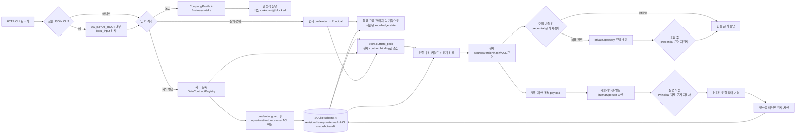

# v0.3 업무 계약·원문 근거·검토된 Wiki 아키텍처

이 구현의 중심은 모델이 아니라 계약입니다. 요청은 회사·업무·데이터 계약을 통과하고, SQLite의 현재 지식 상태와 **현재 등록된 계약 binding**이 모두 맞는 근거만 검색합니다. 실행 후보는 별도의 사람 승인 뒤에도 현재 신원, 객체, 문서 version/hash/ACL/contract binding을 다시 확인해야 효과가 생깁니다.

[Palantir Ontology](https://www.palantir.com/docs/foundry/ontology/why-ontology)의 데이터·논리·행위·보안 결합과 [Ontology-augmented generation](https://www.palantir.com/docs/foundry/ontology/ontology-augmented-generation)의 단계적 검색 개선을 참고했지만 Palantir 제품·SDK·호환성을 구현하지 않습니다.

## 한 요청이 통과하는 실제 흐름

모델 출력에서 실행기로 가는 직접 연결은 없습니다. 도입 진단도 제안·승인을 자동 생성하지 않습니다.

## 상호작용 표

| 트리거 | 입력·현재 상태 | 처리 컴포넌트 | 데이터·외부 접점 | 출력 | 검증 신호 | 실패 처리 |
|---|---|---|---|---|---|---|
| `POST /v1/onboard` | 회사 프로필·업무 인테이크·요청 배치 | `assess_onboarding` | 외부 접점 없음 | blocked/on_hold/pilot_review와 이유 | 결정적 동일 입력, unknown·충돌 보존 | region/model/tool 증거 `UNKNOWN`을 포함한 핵심 unknown은 blocked; `REPORTED`는 자기신고이며 실행·출시 자격이나 진위 확인이 아님 |
| `POST /v1/knowledge/import` | 등록 계약과 변경 문서만 든 단일 파일 delta snapshot | `api_extensions` → snapshot adapter → 지식 적용 | 요청 JSON·SQLite | 새 head와 현재 가시성으로 투영한 변경 문서 영수증 | 요청 단계 중복 문서 ID 거부, transaction 안 exact credential 재인증, 전체 envelope digest, 엄격 증가 `observed_at`, CAS | 동일 accepted replay만 watermark 전 처리; 반환 `documents`는 현재 메타데이터 가시성으로 투영, 누락 문서 자동삭제 없음 |
| `POST /v1/knowledge/apply` | 변경 배치·예상 tenant/source revision·요청키 | `api_extensions` → 지식 서비스 | SQLite 트랜잭션 | 적용 결과·새 head·현재 가시성으로 투영한 문서 목록 | transaction 안 exact credential 재인증, upsert 전 tenant 문서 ID namespace, 계약 권한+기존 문서 저장 ACL tenant/group/clearance, `apply` namespace, CAS, 영구 source-version history | 잘못된 managed ID·계약 위반은 422, 기존 문서 ACL 불명·권한 없음·타 계약은 404, revision·payload 불일치와 과거 version 재사용 거부 |
| `GET /v1/knowledge/state` | 인증 Principal·tenant·등급·그룹 | `knowledge_visibility`를 거친 지식 상태 조회 | SQLite 현재 head·live registry | tenant revision/state hash, 보이는 문서와 관리 가능한 계약의 source head | ACL snapshot·현재 binding·계약 관리 가능성 재검사 | 타 tenant·권한 부족, 현재 ACL에서 숨은 문서·원천, ACL 불명 legacy 메타데이터는 반환하지 않음 |
| `POST /v1/ask` | 질문·목적·민감도·현재 Principal | current pack → retrieval → optional generation | SQLite, 선택한 모델 종단 | 근거·인용·유보 또는 검토 초안 | ACL, source version/hash, 인용 substring, 전후 재검사 | stale·권한 회수·반출 불허·허위 인용 거부 |
| 제안→승인→실행 | 객체 version·evidence snapshot·현재 Principal | ActionEngine | SQLite 로컬 검토 상태 | proposal·simulation·receipt | 모든 action write 직전 exact credential 재인증, 제안·승인 당시 actor kind/person binding, human approver, 현재 contract binding | service 승인·동일인·사람 재할당·만료·stale·권한 회수 차단 |
| `POST /v1/release/evaluate` | 기준선·후보·criteria·evidence digest·target manifest | `api_extensions` → `evaluate_release` | 외부 접점 없음 | veto·기준별 실패·릴리즈 경계 | 여덟 artifact manifest, criteria→rubric SHA, case ID/domain/fixture→case-set SHA, 안전 veto | 중복 case ID는 입력 거부; manifest·rubric·case-set 불일치는 blocked; 합성 통과도 현장 준비로 승격하지 않음 |

## 핵심 계약과 코드

| 책임 | 코드 | 계약 |
|---|---|---|
| 업무 진단 | `intake.py`, `assessment.py` | `BusinessIntake → Assessment` |
| 회사 도입 준비도 | `onboarding_contracts.py`, `onboarding.py` | `CompanyProfile + BusinessIntake → OnboardingReport` |
| 데이터 계약 | `data_contracts.py` | 서버 등록 `DataContractRegistry`, 문서 원천·범위·ACL·수명주기·출처 검증 |
| 변경 가능한 지식 | `knowledge.py`, `knowledge_mutations.py`, `knowledge_history.py`, `knowledge_schema.py`, `knowledge_visibility.py` | schema 4, contract binding, CAS, source version history, snapshot watermark, 분리된 apply/import 멱등 namespace, 내부 ACL snapshot·계약 기반 상태 투영 |
| 현재 지식 조립 | `knowledge_binding.py`, `knowledge_store.py`, `store.py` | 현재 registry와 tenant/id/version/source/hash가 일치하는 managed 문서만 포함; bootstrap 문서는 정적 정책 유지 |
| 선언형 업무 모델 | `ontology.py` | 객체·관계·문서·허용 행위가 있는 `DomainPack` |
| 인증·인가 | `auth.py`, `oidc*.py`, `policy.py` | 명시적 `opaque_only`/`jwt_only`/`both`, ActorKind/person binding → 서버 등록 `Principal` |
| 권한 우선 검색 | `retrieval.py` | 현재 pack + query + Principal → 인용 가능한 근거 |
| 모델 경계 | `providers.py`, `generation.py` | 반출 정책·민감도·host 계약을 통과한 검토 초안 |
| 승인 실행 | `proposal_builder.py`, `action_authorization.py`, `actions.py` | 동결 payload → 시뮬레이션 → 독립 human/person 승인 → 현재 상태 재검사 → 영수증 |
| 릴리즈 평가 | `release_gate.py` | pack/data contract/model/prompt/policy/case set/rubric/code manifest + criteria/case-set canonical SHA + 안전 veto + 독립 품질·거부·지연·비용 기준 |
| API·CLI | `api.py`, `api_extensions.py`, `client_cli.py`, `v02_cli.py`, `local_input.py` | 코어 경로와 v0.2 확장 route, loopback API CLI, 제한된 로컬 JSON 입력 |

Pydantic 계약은 알 수 없는 필드를 거부하고 frozen/strict 경계를 사용합니다. 이것이 원천 데이터의 진실성이나 담당자 진술의 정확성을 인증하지는 않습니다.

## current pack과 지식 수명주기

v0.1의 bootstrap `DomainPack`은 DB 초기화 때 지식 문서로 이관되며 원래 `pack_hash`는 유지됩니다. v0.2의 현재 DB schema는 4입니다. `Store.current_pack`은 요청마다 live contract resolver를 한 번 읽고, managed 문서에 저장한 `contract_id`, `contract_version`, `contract_sha256`, source와 tenant가 현재 registry와 모두 일치할 때만 활성 문서로 조립합니다. 계약 hash는 `required_provenance` 같은 집합 필드를 정렬한 canonical 직렬화에서 계산해 프로세스 재시작 사이에도 같은 계약이 같은 값을 갖게 합니다. 계약이 없어지거나 바뀌거나 binding이 비어 있으면 문서를 검색·제안·승인·실행 근거에서 제외합니다. `contract_*`가 null인 bootstrap 문서는 `bootstrap.<document_id>` source 규칙과 기존 pack 정책으로만 허용합니다.

schema 2 개발 DB의 기존 managed row는 계약 binding을 복원할 수 없어 기본적으로 숨깁니다. `contract_id`가 null인 같은 문서 ID는 일반 upsert로 소유권을 주장할 수 없으므로 관리자 migration이나 새 문서 ID 같은 명시적 복구가 필요합니다. schema 2→4 마이그레이션은 현재 row와 기존 receipt로 accepted source-version history를 재구성하고 기존 batch를 `apply` namespace로 옮깁니다. 과거 snapshot의 self-reported `observed_at`은 복원할 수 없습니다. 대신 source별 마지막 knowledge batch 감사 시각을 보수적 watermark 상한으로 쓰고, 감사 매핑이 없는 managed source는 migration 시각을 씁니다. 후속 snapshot은 이 상한보다 엄격히 커야 하며, 상한은 원천 진위나 실제 수집 시각 인증이 아닙니다.

schema 4는 응답 계약에 드러나지 않는 내부 `access_json` snapshot을 추가합니다. schema 2·3 행은 본문이 남아 있고 그 안의 ACL hash가 저장 `access_sha256`과 맞을 때만 이를 backfill합니다. 본문이 제거된 legacy tombstone처럼 ACL을 알 수 없는 메타데이터는 상태 조회에서 fail-closed로 숨깁니다.

문서 상태는 다음 의미를 가집니다.

| 상태·변경 | 검색·실행 영향 | 저장 한계 |
|---|---|---|
| upsert | 새 source version, 본문 hash, ACL, provenance, contract ID/version/hash와 tenant-prefixed 문서 ID를 현재 근거로 사용 | 과거에 수락된 같은 source version은 문서가 이후 바뀌었어도 재사용 불가 |
| retire | 현재 검색에서 제외하되 본문·변경 이력과 직전 ACL snapshot을 유지 | 메타데이터도 해당 ACL로만 보이며 법적 보존·원천 폐기와 별개 |
| tombstone | document JSON의 본문·title·source URI를 제거하고 논리 삭제 표식, source version/history, 직전 ACL snapshot을 유지 | 현재 contract binding으로 갱신하며 메타데이터도 해당 ACL로만 보임; DB 파일·WAL·백업·검색 서비스·provider의 물리 삭제 증명이 아님 |
| ACL 변경 | 현재 읽기와 이후 승인·실행의 근거 접근을 다시 제한 | 원천 ACL 동기화는 별도 커넥터 책임 |

기존 문서를 upsert, retire, tombstone, ACL 변경하기 전에는 호출자가 저장 ACL snapshot의 tenant, group, clearance를 만족해야 합니다. 문서 ACL의 purpose는 이 쓰기 검사에서 생략하지만, 현재 계약의 `READ+AUDIT+MANAGE_KNOWLEDGE` 권한은 계속 요구합니다. ACL snapshot이 없거나 조건을 만족하지 못한 **기존 문서 mutation**은 구체적인 실패 원인을 나누지 않고 `document_not_found` 404로 닫습니다. 새 문서는 저장 ACL이 아직 없으므로 candidate access가 현재 계약을 만족하는지를 검증합니다. 이 404 통일은 모든 ID 존재 은닉을 보장하지 않습니다. 같은 tenant의 upsert에서는 미사용 ID 생성 성공, 이미 사용 중인 비가시 ID의 404, candidate 계약 오류의 422가 구분될 수 있습니다.

managed upsert는 전역 `document_id` 조회 전에 `document_id.rpartition(".")[0]`이 계약 tenant와 정확히 같고 마지막 접미부가 비어 있지 않으며 점을 포함하지 않는지 확인합니다. tenant가 `acme`이면 신규 ID는 `acme.<점이 없는 접미부>` 형식입니다. 이 검사는 cross-tenant ID에 존재 여부와 관계없는 422를 반환해 다른 tenant의 ID를 선점하거나 탐색하는 경로를 닫습니다. 전역 기본 키와 같은 tenant 안의 ID 공간은 남으므로 ID에 민감한 의미를 넣지 않고, 서버가 신뢰하는 ID 할당자와 계약별 접미부 규칙을 두거나 더 강한 격리가 필요하면 tenant별 DB를 사용합니다. 점이 포함된 tenant도 마지막 점을 기준으로 exact prefix를 검사합니다. 검증 대상은 신규 managed upsert의 document ID입니다. bootstrap·legacy 행을 재작성하거나 entity/action/object와 일반 ontology ID 전체에 같은 namespace를 강제하지 않습니다.

managed 신규·기존 upsert의 candidate access와 `change_acl` 대상에서 `groups`가 비면 `data_contract_violation` 422로 거부합니다. 같은 트랜잭션의 문서, tenant/source revision, accepted-version history와 감사는 바뀌지 않습니다. 이는 managed active 문서가 어떤 관리 그룹도 갖지 않는 orphan이 되는 것을 막는 규칙이며 공통 `Access`나 bootstrap의 deny-all 표현을 없애지 않습니다. 완전한 접근 회수는 빈 그룹 ACL 변경이 아니라 명시적 retire/tombstone으로 처리합니다.

`change_acl`은 단순 메타데이터 수정이 아닙니다. 저장 ACL의 tenant/group/clearance를 만족하고 계약 권한을 가진 관리자는 계약 범위 안에서 groups, purposes, 민감도를 확장하거나 축소할 수 있습니다. purpose를 추가하면 새 주체가 문서 본문을 읽게 될 수 있으므로 회사의 위임·승인 정책이 이 권한을 통제해야 합니다.

기존 문서 upsert는 요청 계약의 tenant, source와 contract ID가 저장 binding과 같고 새 source version을 쓸 때 현재 contract version/hash로 다시 묶을 수 있습니다. retire와 ACL 변경은 저장된 contract version/hash까지 현재 요청 계약과 정확히 같아야 합니다. tombstone은 삭제 정리를 막지 않기 위해 tenant, source, contract ID가 같으면 version/hash drift를 허용하고 결과 메타데이터를 현재 binding으로 기록합니다. 다른 tenant/source/contract ID, legacy ACL 불명 또는 다른 기존 변경의 binding 불일치는 `document_not_found`입니다.

registry에서 계약을 먼저 제거하면 해당 계약 ID를 해석할 수 없어 API retire/tombstone 경로도 끊깁니다. 계약 제거 전에 실제 보존을 확인하고 명시적으로 retire/tombstone합니다. 제거 뒤 정리가 필요하면 같은 tenant/source/contract ID를 통제해 재등록하고 저장 ACL 검사를 통과한 drift tombstone을 사용합니다. `delete_within_hours`는 선언값이며 원천, WAL, 백업과 provider 삭제를 스케줄링하거나 증명하지 않습니다.

변경 배치는 tenant/source revision을 비교·교환합니다. `apply`와 `import`는 request-key namespace를 분리합니다. import 파일은 전체 원천 복제본이 아니라 **변경 문서만 포함하는 delta snapshot**입니다. 한 envelope 안의 문서 ID 중복은 요청 계약에서 거부합니다. import digest는 `observed_at`을 포함한 전체 envelope에 묶이고, 성공한 동일 envelope replay만 watermark 검사 전에 기존 저장 영수증을 읽습니다. 신규 성공과 replay 모두 반환 `documents`를 현재 저장 record의 exact binding과 호출자의 문서 ACL `READ/AUDIT` 가시성으로 투영합니다. 저장된 원본 영수증과 감사 이벤트, 상위 tenant/contract/request/payload/revision 필드는 바꾸지 않습니다. 따라서 ACL 변경으로 호출자 자신의 group이 빠지면 성공 응답도 빈 배열일 수 있고, 권한·binding 변경 뒤 replay 배열도 줄 수 있으며 응답 전체가 항상 byte-identical하다고 보장하지 않습니다. 신규 `observed_at`은 같은 tenant/source의 이전 값보다 엄격히 커야 하며, 변경 문서는 과거에 수락하지 않은 새 `source_version`을 사용합니다. 파일에 없는 문서는 그대로 두고 자동 retire/tombstone하지 않으므로 삭제·정정은 명시적 `apply` 변경으로 제출합니다.

`KnowledgeState.tenant_revision`과 `state_hash`는 tenant 전체 변경의 CAS aggregate이지만, `sources`와 `documents`는 전체 tenant 재고가 아닙니다. `documents`는 `READ`가 있는 호출자가 자신의 등급·그룹으로 `AUDIT` 목적에서 볼 수 있고 현재 contract binding을 만족하며 그 호출자가 관리할 수 있는 계약에 속한 메타데이터만 반환합니다. bootstrap 문서도 자체 ACL로 거릅니다. `sources`는 같은 호출자가 관리할 수 있는 현재 계약의 source만 반환합니다. 하나의 source를 여러 계약이 공유하면 허용된 source head의 revision/hash는 그 source의 aggregate 변경을 반영할 수 있습니다. retire·tombstone은 변경 직전 ACL snapshot을 보존해 메타데이터 노출을 계속 제한하고, snapshot을 신뢰할 수 없는 legacy 행은 숨깁니다.

문서 생성이나 최종 `DomainPack` 검증 하나가 실패해도 같은 배치의 문서·ACL 변경, accepted-version history, watermark, revision, 감사 기록을 모두 rollback합니다. 트랜잭션과 감사 기록은 프로세스 재시작 뒤에도 SQLite에서 복구됩니다. 단일 SQLite의 동시성·암호화·RLS·외부 불변성 한계는 그대로입니다.

지식 apply/import는 SQLite 트랜잭션을 연 직후 exact credential을 재인증하고 live registry에서 같은 contract ID/version/canonical hash와 현재 권한을 다시 확인한 뒤 replay·CAS·변경을 처리합니다. 이 확인은 한 트랜잭션의 결정에 현재 읽은 계약을 사용하게 하지만, 외부 registry 파일 교체와 SQLite commit을 하나의 원자적 저장소 연산으로 만들지는 않습니다. 운영자는 설정 파일의 ACL·원자 교체·배포 세대와 DB 변경 기록을 함께 관리해야 합니다.

`document_record`는 저장된 `Document` JSON을 계약으로 파싱하고 문서 ID, source version, access tenant, 본문 SHA, access SHA가 같은 row의 메타데이터와 일치하는지 읽을 때 검사합니다. 파싱 실패나 불일치는 `knowledge_integrity_failure`로 닫힙니다. 이 검사는 손상의 일부를 조기에 차단하는 좁은 방어입니다. 메타데이터에 대응 hash가 없는 title, object scope, `valid_until`, source URI, 전체 canonical document JSON과 state head의 변조를 모두 검출하지 않으며 audit event chain이나 외부 anchor를 대신하지 않습니다.

## 릴리즈 계산의 결합 범위

`ReleaseEvaluation`은 case ID 중복을 계약 오류로 거부합니다. target manifest의 `rubric.sha256`은 실제 `ReleaseCriteria`의 canonical SHA와, `case_set.sha256`은 각 case의 ID·domain·fixture digest를 정렬해 만든 canonical SHA와 일치해야 합니다. evidence와 각 case도 같은 target manifest SHA를 참조해야 합니다. 하나라도 다르면 측정값이 좋아도 `blocked`입니다.

품질, 불필요 거부율, 평균 지연, 평균 비용은 case의 원값으로 산술평균하고 반올림하지 않은 값으로 절대 threshold와 baseline 회귀 threshold를 판정합니다. 응답에 보이는 소수 자릿수를 별도 판정값으로 해석하지 않습니다. 이 결합은 제출된 식별자와 입력 계산의 일관성을 높이지만 fixture 내용, 측정 수행, evidence origin 또는 현장 효과의 진실성을 인증하지 않습니다.

## 검색·생성·실행의 검증 시점

1. 검색 전에 tenant, 그룹, 등급, 목적, READ 권한으로 객체와 문서를 줄입니다.
2. 관계 탐색은 코드의 bounded hop·결과 한도 안에서 수행하며 조용한 절단 대신 명시적으로 실패합니다.
3. 문서 ID뿐 아니라 source identifier/version, content hash, ACL hash, lifecycle과 현재 contract binding을 가져옵니다.
4. 모델 호출 직전에 현재 credential과 검색 근거를 다시 확인합니다. provider의 미확인 텍스트 등급 기본 하한은 `RESTRICTED`이며, 분류·전송·host·모드가 맞지 않으면 호출하지 않습니다.
5. 모델 응답 뒤에도 credential과 근거가 그대로 유효한지 확인하고, 제공 근거에 실제로 있는 문서 ID와 연속 원문만 인용으로 허용합니다.
6. 모든 action write와 knowledge state/apply/import는 전달된 바로 그 credential을 transaction 안에서 다시 인증합니다. raw credential은 응답·로그·DB에 저장하지 않습니다.
7. 제안 payload는 proposer의 `actor_kind`와 유효 `person_id`, 승인 record는 approver의 같은 binding을 고정합니다. 새 제안의 동일 request-key replay와 미완료 제안의 approve·execute 때 현재 매핑과 비교하므로 subject가 유지돼도 뒤의 사람이 바뀌면 `principal_identity_changed`로 중단합니다. 승인자는 `ActorKind.HUMAN`이어야 하며 subject가 달라도 같은 `person_id`면 자기 승인입니다. terminal 제안의 멱등 execute replay·rollback 호환은 별도 경계로 유지합니다.
8. approve와 execute는 제안 때 고정한 모든 evidence snapshot을 현재 문서 상태와 비교합니다. 근거 하나의 version/hash/ACL/lifecycle/contract binding이 바뀌면 실행을 중단합니다.

이 재검사는 모델 호출과 상태 변경 사이의 권한 회수·문서 교체 경쟁을 줄이지만, 외부 모델이 이미 받은 입력을 회수하거나 provider 삭제를 증명하지는 못합니다.

## 설계 선택과 대안

- SQLite는 참조 구현의 재현성과 단일 트랜잭션을 위해 선택했습니다. 다중 인스턴스·대규모 테넌트 운영은 PostgreSQL RLS, 외부 감사 앵커, KMS와 부하 검증이 필요합니다.
- pinned JWKS는 네트워크 중간의 키 교체·SSRF를 줄이기 위해 서버 등록 파일만 신뢰합니다. 운영 IdP discovery·로그인·토큰 발급·세션은 별도 통합입니다.
- JSON 파일을 받는 CLI는 `AX_INPUT_ROOT`(기본 현재 작업 디렉터리) 안의 일반 로컬 파일만 읽습니다. UNC/device/ADS/reparse/outside-root를 거부합니다. `init`·`assets` 출력 목적지와 runtime 운영 설정 경로는 이 입력 reader와 다른 신뢰 경계입니다.
- keyword + bounded graph 검색은 실패를 해석하고 평가하기 쉬운 기준선입니다. embedding·rerank·GraphRAG는 gold set에서 오류와 비용이 실제로 줄 때만 추가합니다.
- 논리 tombstone은 현재 사용을 즉시 차단하고 이력을 남기기 위한 선택입니다. 물리 삭제는 매체별 검증 가능한 작업으로 따로 운영합니다.
- 모델은 검토 초안을 만들 뿐입니다. 결정적 정책·돈 이동·권리·안전·최종 승인과 실제 시스템 효과는 엔진과 사람이 소유합니다.

보안 가정은 [SECURITY_MODEL.md](SECURITY_MODEL.md), 실행·복구는 [OPERATIONS.md](OPERATIONS.md), 실제 코드 읽기 순서는 [LEARNING_GUIDE.md](LEARNING_GUIDE.md)에 있습니다.

## 검토된 Wiki 계층

Wiki는 원문 knowledge와 같은 SQLite 안에 별도 draft/head/version/source/link 테이블로 저장합니다. `WikiService`는 현재 원문 RAG의 결과 전체를 `input_citations`와 `source_bindings`로 결속합니다. 모델은 write transaction 밖에서 초안을 만들고, 서버는 호출 뒤 현재 시각·credential·원문·객체·계약을 다시 검사합니다. 초안의 `citations`는 출력 인용이고 모든 모델 입력 원문과 구분합니다.

서로 다른 실제 사람이 검토 자료를 읽고 정확한 payload hash를 게시해야 검색에 들어갑니다. 조회·index·backlink·lint·export는 모든 원문의 과거·현재 ACL, 목적과 현재 객체권한을 통과해야 합니다. object_id/hops 검색은 원문과 Wiki 양쪽에 같은 scope를 적용합니다. Wiki가 action evidence나 raw source가 되는 경로는 없습니다. 구현 지도와 생명주기 전파는 [Wiki 가이드](LLM_WIKI_GUIDE.md), 실행은 [v0.3 가이드](V03_GUIDE.md)를 따릅니다.

공통 객체 정책은 저장 query를 각 caller의 현재 권한으로 재탐색하여 결속 객체 전체가 현재 scope에 포함되는지 확인하고, 현재 관계 민감도까지 분류 하한에 반영합니다. 관계 ACL 회수는 packet·게시·조회·export를 막으며, 분류 상승은 낮은 분류의 결과를 숨기고 권한 있는 manager의 재컴파일을 요구합니다. 현재 허용된 대체 경로가 전체 scope를 만족하면 접근할 수 있습니다. 정확한 과거 링크 ID·type·경로는 결속하지 않으므로 역사적 관계 변경을 감지하는 별도 provenance 기능은 필요합니다.
