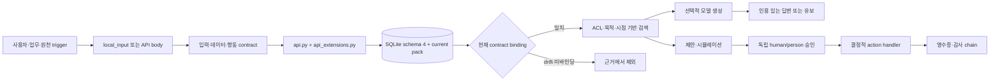

# 코드와 실행으로 배우는 v0.2

이 가이드의 목표는 명령을 외우는 것이 아니라 **trigger → contract → SQLite/current pack → RAG → approval → action/evidence** 흐름에서 어떤 계층이 무엇을 보장하고, 무엇을 보장하지 않는지 설명하는 것입니다. 먼저 합성 입력으로 실행하고, 그 다음 한 가지 조건만 바꿔 결과를 비교합니다.

## 1. 전체 지도를 먼저 본다



| 구간 | 읽을 코드 | 핵심 질문 |
|---|---|---|
| 입력 계약 | `local_input.py`, `intake.py`, `onboarding_contracts.py`, `data_contracts.py` | 로컬 파일 경계, unknown, 정책 충돌을 어떻게 구분하는가? |
| 인증 | `auth.py`, `oidc_tokens.py`, `common.py` | 토큰 claim이 서버 Principal 권한으로 어떻게 제한되는가? |
| API 조립 | `api.py`, `api_extensions.py` | 코어 route와 v0.2 확장이 같은 현재 registry·credential 경계를 어떻게 쓰는가? |
| 저장 | `store.py`, `knowledge_schema.py`, `knowledge_store.py`, `knowledge_binding.py`, `knowledge_visibility.py` | pack hash와 schema 4 운영 문서·계약 binding·ACL snapshot을 왜 분리하는가? |
| 지식 변경 | `knowledge_contracts.py`, `knowledge.py`, `knowledge_history.py` | CAS·멱등 namespace·watermark·version history가 어떤 경쟁과 되돌림을 막는가? |
| 검색·생성 | `retrieval.py`, `generation.py`, `providers.py`, `api.py` | 모델 호출 전후 무엇을 다시 확인하고 등급 하한을 어디서 적용하는가? |
| 행동 | `proposal_builder.py`, `action_authorization.py`, `actions.py` | 근거가 바뀐 승인을 왜 실행하지 않는가? |
| 릴리즈 | `release_gate.py` | 평균 품질보다 우선하는 veto는 무엇인가? |

[아키텍처 문서](ARCHITECTURE.md)의 상호작용 표를 옆에 두고 각 함수가 표의 어느 행을 구현하는지 표시해 보세요.

## 2. 합성 파일럿을 실행한다

```powershell
uv sync --extra dev
uv run ax init .runtime\learning --domain procurement
uv run ax assets .runtime\public-v02
uv run ax pack validate .runtime\learning\domain-pack.json
uv run ax demo --domain procurement
```

`init`은 합성 credential을 포함한 개인 학습 폴더를 만들고, `assets`는 credential 없이 업종별 v0.2 예제와 `schemas/data-contracts.schema.json`, `knowledge-mutation-batch.schema.json`, `source-snapshot.schema.json` 등을 내보냅니다. 두 명령 모두 기존 폴더를 덮어쓰지 않으므로 매번 새 경로를 사용합니다. JSON 파일을 읽는 CLI는 기본적으로 현재 작업 디렉터리를 `AX_INPUT_ROOT`로 사용하고 root 밖, UNC·device·ADS·reparse 경로를 거부합니다. init/assets 출력 목적지와 runtime 설정 경로는 이 guard의 대상이 아닙니다.

`demo` 출력은 합성 상태 전이의 관찰 자료입니다. 출력에 특정 버전·건수가 나타났다는 사실을 회사 성능이나 출시 검증으로 해석하지 않습니다. 다음을 직접 설명할 수 있어야 합니다.

- 제안자, 승인자, 실행자의 권한이 어디에서 갈리는가.
- simulate 결과의 hash가 approve 입력이 되는 이유.
- 같은 request key 재시도와 새 의도의 요청을 어떻게 구분하는가.
- rollback이 과거를 지우는 대신 새 상태와 감사 기록을 만드는 이유.

## 3. 도입 진단에서 unknown을 남긴다

```powershell
uv run ax onboard evaluate examples\v0.2\onboarding-request.json
uv run ax onboard evaluate .runtime\learning\onboarding-request.json
```

`onboarding_contracts.py`의 `CompanyProfile`은 회사의 배치, 데이터 등급, 전송, 리전, 모델, 도구, 보존, 그룹과 승인 상태를 담습니다. `BusinessIntake`는 실제 업무 단계와 통제 지점을 담습니다. `onboarding.py`는 두 입력을 결정 규칙으로 결합합니다.

저장소의 정적 `examples/v0.2` 요청은 `REPORTED` 자기신고 항목을 채운 결정 규칙 예시라 현재 `pilot_review`를 반환합니다. `REPORTED`는 제출된 상태일 뿐 원천 진위, 현장 통제 작동이나 보안 인증을 검증하지 않으며 결과도 `live_validated=false`, `security_certified=false`입니다. `ax init`이 만든 개인 학습 폴더의 요청은 실제 회사 책임자·근거·승인이 `UNKNOWN`이어서 `blocked`를 반환합니다. 두 결과의 이유와 `next_steps`를 비교합니다.

연습:

1. 복사한 요청에서 `risk_owner`를 `null`로 바꿉니다. `missing_information`과 `next_steps`를 확인합니다.
2. `security` 승인을 `rejected`로 바꿉니다. 단순 정보 부족과 명시 거절의 판정 차이를 설명합니다.
3. 허용하지 않은 모델을 `requested_models`에 넣습니다. 정책 충돌이 업종 이름과 무관하게 발생하는지 확인합니다.
4. `region_policy`, `model_policy`, `tool_policy`를 하나씩 `UNKNOWN`으로 바꿔 각각의 `*_evidence_unknown` 이유와 `blocked` 판정을 확인합니다. 다시 `REPORTED`로 바꿔도 진위 검증 필드가 생기지 않는 이유를 설명합니다.

어떤 입력이든 결과의 `self_reported_readiness`, `live_validated=false`, `security_certified=false` 경계를 유지합니다. 이 진단은 제출된 값의 진위를 확인하지 않습니다.

## 4. 데이터 계약을 해부한다

```powershell
uv run ax contract validate examples\v0.2\data-contract-registry.json
```

`DataContract`에서 다음 연결을 따라갑니다.

- `collection_source.identifier/uri` ↔ 문서의 `origin`
- `object_scope` ↔ 문서가 근거로 연결할 객체
- `access`와 `minimum_sensitivity` ↔ 허용 tenant/group/purpose/등급
- `expected_content_sha256`와 `required_provenance` ↔ 내용·provenance 주장
- `lifecycle` ↔ refresh, retention, deletion, reconciliation 의무

`contract validate`는 구조와 내부 일관성을 확인합니다. URI의 자격 증명 유출 패턴을 거부하지만 원천 서버에 로그인하거나 문서 서명을 검증하지 않습니다. `document-candidate.json`의 hash를 바꾸거나 tenant를 바꾼 뒤 `validate_document`가 어느 violation을 내는지 테스트로 확인해 보세요.

설계 이유: 계약을 요청 본문에서 받으면 호출자가 검증 규칙도 함께 고를 수 있습니다. v0.2는 서버에 등록된 `DataContractRegistry`에서 tenant와 contract ID로 정책을 해석합니다.

## 5. SQLite 지식 변경을 따라간다

서버를 [운영 가이드](OPERATIONS.md)대로 시작하고 `manage_knowledge`와 `audit` 권한이 있는 합성 주체로 접속합니다.

```powershell
$env:AX_API_BASE = 'http://127.0.0.1:8000'
$taskLearning = (Resolve-Path .runtime\learning).Path
$taskCredentials = Get-Content (Join-Path $taskLearning 'demo-credentials.json') -Raw | ConvertFrom-Json
$env:AX_TOKEN = ($taskCredentials.credentials | Where-Object subject -eq 'steward').token
uv run ax knowledge state
uv run ax knowledge import (Join-Path $taskLearning 'source-snapshot.json')
uv run ax knowledge state

$taskRetire = @'
{
  "contract_id": "demo-knowledge",
  "request_key": "learning-retire-1",
  "expected_tenant_revision": 1,
  "expected_source_revision": 1,
  "mutations": [
    {"operation": "retire", "document_id": "acme.pilot-policy-1"}
  ]
}
'@
$taskRetirePath = Join-Path $taskLearning 'retire-batch.json'
[IO.File]::WriteAllText($taskRetirePath, $taskRetire, [Text.UTF8Encoding]::new($false))
uv run ax knowledge apply $taskRetirePath
uv run ax knowledge state
```

서버의 `AX_PACK_FILE`, `AX_AUTH_FILE`, `AX_DB_FILE`, `AX_DATA_CONTRACTS_FILE`도 같은 `.runtime\learning` 폴더의 `domain-pack.json`, `identities.json`, 새 `learning.db`, `data-contracts.json`을 가리켜야 합니다. `demo-credentials.json`은 합성 토큰을 학습 셸에만 전달하는 파일이며 인증 registry로 쓰지 않습니다. `source-snapshot.json`은 `ax init` 시점에 만든 합성 delta 입력이므로 계약 갱신 주기가 지나기 전에 실행합니다. 전체 원천 복제본이 아니라 변경 문서만 담는다는 점을 유지하고, 오래된 시각을 고쳐 쓰지 말고 새 학습 폴더를 초기화합니다. 실제 토큰을 파일이나 출력에 복사하지 않습니다.

위 `knowledge apply` 예제는 바로 앞 import로 생긴 합성 문서를 retire합니다. 중간에 다른 변경을 수행했다면 revision을 추측해 바꾸지 말고 `knowledge state`의 tenant revision과 `sources`에 있는 `demo-source` revision을 다시 확인해 새 배치를 검토합니다. state의 `sources`와 `documents`는 호출자의 등급·그룹, 문서 ACL purpose, 관리 가능한 현재 계약으로 제한되므로 전체 tenant 재고가 아닙니다. 기존 문서 mutation은 저장 ACL의 tenant/group/clearance를 별도로 검사하되 문서 purpose는 생략하므로, state에서 숨겨진 모든 문서가 반드시 쓰기 불가라고 일반화하지 않습니다. upsert를 연습하려면 새 `request_key`, 현재 tenant/source revision, 그 문서에서 아직 수락하지 않은 새 source version의 candidate, `title`, timezone이 있는 `valid_until`을 넣습니다.

코드 흐름:

1. `api.py`의 `knowledge_service()`가 `manage_knowledge`+`audit` 권한과 서버 registry를 확인합니다.
2. `KnowledgeService`가 트랜잭션을 연 직후 read/replay 전에 요청에 쓰인 exact credential을 다시 인증합니다.
3. `KnowledgeService.apply()`가 등록 계약, 분리된 apply/import request-key namespace, tenant/source CAS를 검사합니다. 신규 성공과 replay 모두 응답 `documents`를 현재 저장 record의 exact binding과 문서 ACL `READ/AUDIT` 가시성으로 투영하며, 이 투영은 DB에 저장하는 canonical receipt/audit를 수정하지 않습니다.
4. `knowledge_mutations.py`가 managed upsert ID의 exact tenant prefix와 점 없는 비어 있지 않은 접미부를 DB 조회 전에 검사한 뒤, 기존 문서의 저장 ACL tenant/group/clearance를 확인합니다. 문서 purpose는 쓰기 검사에서 생략하지만 계약의 `READ+AUDIT+MANAGE_KNOWLEDGE`는 유지합니다.
5. `validate_document()`가 원천·scope·ACL·등급·hash·provenance를 대조합니다. managed upsert와 ACL 변경의 새 groups가 비면 422로 거부하고, upsert가 현재 contract ID/version/hash를 문서에 고정합니다.
6. 문서 생성과 최종 `DomainPack` 검증을 통과하지 못하면 `document_domain_invalid`로 정규화하고 배치 전체를 rollback합니다.
7. `knowledge_store.py`가 문서, 내부 ACL snapshot, accepted source-version history, source watermark, revision head, idempotency receipt, audit event를 한 트랜잭션에 기록합니다.
8. `knowledge_visibility.py`가 state 문서와 source head를 actor의 등급·그룹·`AUDIT` 목적과 관리 가능한 계약으로 거릅니다. retire/tombstone은 직전 ACL snapshot을 쓰고 ACL 불명 legacy 메타데이터는 숨깁니다.
9. `Store.current_pack()`이 live registry를 한 번 읽고 현재 tenant·source·contract binding이 모두 일치하는 active 문서만 bootstrap 객체·관계와 합성합니다.

변형 과제:

- **경쟁 변경:** 같은 expected revision의 서로 다른 두 배치를 순서대로 보내 두 번째가 거부되는 이유를 설명합니다.
- **멱등 재시도:** 같은 namespace의 request key와 payload를 다시 보냅니다. 권한·binding이 그대로면 같은 내용인지 확인하고, 그 뒤 ACL을 회수해 replay 응답 `documents`만 줄며 저장 receipt/audit와 revision은 바뀌지 않는 이유를 설명합니다. ACL 변경으로 자기 group을 제거한 성공 응답도 `documents=[]`일 수 있습니다. payload 하나를 바꾸면 충돌해야 하며, 같은 문자열 키라도 apply/import는 서로 다른 공간입니다.
- **쓰기 ACL:** 계약 관리 권한은 같지만 기존 문서의 group·clearance가 다른 주체로 upsert/retire/tombstone/change_acl을 보내 모두 404와 무변경인지 확인합니다. 문서 purpose만 다른 사례와 저장 ACL 불명 legacy 사례를 구분합니다.
- **ID namespace:** `acme.<점 없는 접미부>`와 같은 정상 ID, 다른 tenant prefix, 빈 접미부, 접미부에 점이 있는 ID를 upsert합니다. 잘못된 ID가 실제 존재 여부와 무관하게 같은 422이며 revision·audit·history가 변하지 않는지 확인합니다. 같은 tenant에서는 미사용 ID 생성 성공과 비가시 기존 ID 404가 달라질 수 있으므로 ID에 민감한 의미를 넣지 않는 이유도 설명합니다.
- **legacy ID 재고:** bootstrap·이전 managed 행에 acme 소유 `beta.doc` 같은 ID를 둔 복사본을 검사합니다. 신규 upsert guard가 이를 자동 rename하거나 trusted admin 파일·entity/action/object ID를 검증하지 않는 이유와 다중 tenant 전에 필요한 owner/prefix 대조를 설명합니다.
- **빈 그룹:** managed 신규 upsert와 ACL 변경의 groups를 빈 배열로 보내 422와 revision/audit/history 무변경을 확인합니다. 비어 있지 않은 다른 그룹 self-revoke와, 모든 접근 회수를 위한 retire/tombstone을 구분합니다.
- **ACL 위임:** 저장 ACL이 겹치는 관리자가 계약 범위 안의 새 group·purpose를 추가했을 때 이후 읽기 가시성이 어떻게 바뀌는지 확인합니다. 이 권한이 단순 메타데이터 수정이 아닌 이유와 회사 승인 조건을 적습니다.
- **생명주기:** retire 후 검색에서 사라지는지, tombstone 후 본문이 논리 레코드에서 제거되고 같은 ID 재생성이 막히는지 확인합니다. 계약 version/hash만 올린 뒤 retire/change_acl은 거부되고, 같은 tenant/source/contract ID의 tombstone은 중간 ACTIVE 재게시 없이 현재 binding으로 기록되는 이유를 설명합니다.
- **순서와 재사용:** 같은 source에서 더 이른 `observed_at`의 신규 snapshot과, 한 문서의 v1→v2→v1 source version 재사용이 거부되는 이유를 설명합니다.
- **delta와 중복:** 변경하지 않은 문서를 다음 snapshot에서 빼도 유지되는 이유를 설명하고, 같은 document ID를 두 번 넣은 복사본이 API에서는 422 `invalid_request`, CLI에서는 `invalid_input_file`로 입력 단계에서 거부되는 경계를 확인합니다.
- **상태 가시성:** 서로 다른 group의 steward가 같은 `knowledge state`를 조회했을 때 문서·source head가 달라질 수 있는 이유와 tenant revision/state hash는 aggregate로 남는 이유를 설명합니다.
- **계약 drift:** registry의 계약 version/hash를 바꾼 뒤 기존 managed 문서가 숨겨지는지 확인합니다. 계속 사용할 문서는 같은 contract ID/source와 새 source version의 upsert로 재등록하고, 삭제할 문서는 저장 ACL 권한을 확인한 tombstone cleanup을 사용합니다.
- **계약 제거:** registry에서 제거하기 전 retire/tombstone이 필요한 이유를 설명합니다. 이미 제거한 실험에서는 같은 tenant/source/contract ID를 재등록하고 저장 ACL을 통과한 drift tombstone만 수행하며, `delete_within_hours`를 실제 원천 삭제 증거로 쓰지 않습니다.

tombstone 실험 뒤 DB 파일 크기가 줄지 않아도 실패라고 단정하지 않습니다. v0.2의 보장은 logical tombstone이며 WAL·백업·미할당 페이지의 물리 삭제는 범위 밖입니다.

## 6. 현재 근거와 모델 경계를 관찰한다

`api.py`의 `fresh_answer()`와 `/v1/ask`를 읽습니다. 생성 요청은 다음 순서를 가집니다.

1. 현재 Principal과 현재 contract binding을 만족하는 current pack에서 검색 결과를 만듭니다.
2. credential을 다시 인증하고 같은 질의의 검색 결과가 같은지 확인합니다.
3. provider 기본 하한 `RESTRICTED`, 질문·근거·인용의 최고 민감도, channel·host·반출 승인을 확인한 뒤 모델을 호출합니다.
4. credential과 검색 결과를 다시 확인합니다.
5. 인용 계약을 만족하는 답변만 반환합니다.

모델 호출 사이에 권한 파일이나 근거 문서의 version/hash/ACL/lifecycle이 바뀌면 생성 결과를 폐기합니다. 이는 모델 제공자에게 이미 전송된 데이터의 회수를 뜻하지 않으므로 반출 승인과 제공자 보존 정책은 호출 전에 닫아야 합니다.

`action_authorization.py`는 simulate/approve/execute마다 제안에 고정한 근거와 current pack을 비교합니다. 모든 action write는 exact credential을 트랜잭션 안에서 다시 인증합니다. 승인자는 human이어야 하고 제안자와 subject가 달라도 같은 `person_id`면 거부됩니다. payload와 승인 record에 고정한 actor kind/person ID도 현재 매핑과 대조하므로 같은 subject 뒤 사람이 바뀐 경우 예전 승인을 재사용할 수 없습니다. binding이 없는 과거 미완료 제안은 새 제안·승인이 필요합니다. 문서 본문은 같아도 source version, ACL 또는 contract binding이 바뀌면 예전 승인을 재사용하지 않는 이유를 설명해 보세요.

## 7. RS256 액세스 토큰 경계를 확인한다

`auth.py`의 기본 모드는 `opaque_only`입니다. `jwt_only` 또는 `both`를 명시하고 구성한 경우에만 `oidc_tokens.py`가 pinned public JWKS로 RS256 access token을 검증합니다. 성공한 `(issuer, subject)`는 서버에 등록된 Principal로 매핑됩니다.

테스트 관찰 과제:

- 올바른 `iss/aud/sub/client_id/exp/iat/nbf`, `kid`, `typ=at+jwt`를 가진 토큰.
- HS256, 알 수 없는 `kid`, 잘못된 audience, 만료·미래 `iat/nbf` 토큰.
- `jku`, `x5u`, inline `jwk`, `crit`로 키 출처를 바꾸려는 토큰.
- 새·옛 pinned key를 겹친 교체 기간과 옛 키 제거 뒤의 차이.
- human user의 `sub != client_id`, service의 `sub == client_id`, service가 승인할 수 없는 경계.

이 실험은 기업 SSO 로그인 전체가 아니라 resource server의 access-token 검증 경계를 보여 줍니다. 테스트용 private key를 운영 파일에 복사하지 않습니다.

## 8. 릴리즈 평가를 변형한다

```powershell
uv run ax release evaluate `
  examples\v0.2\release-evaluation.json `
  examples\v0.2\release-criteria.json
```

현재 합성 예제는 legacy 호환을 보여 주기 위해 target manifest가 비어 있어 먼저 `blocked`입니다. 실제 평가 대상 manifest는 pack, data contract, model, prompt, policy, case set, rubric, code의 version과 SHA-256을 묶습니다. 다음 변경을 하나씩 적용합니다.

1. `target_manifest`를 그대로 비워 manifest 누락 boundary를 확인합니다.
2. manifest를 만들되 evidence 또는 한 case의 `target_manifest_sha256`을 다르게 해 대상 불일치 차단을 확인합니다.
3. manifest를 모두 맞춘 뒤 한 사례의 `safety_failure`를 `true`로 바꿔 평균 품질과 무관한 veto를 확인합니다.
4. candidate 품질을 기준 이하로 바꿔 절대 한도와 baseline 회귀를 구분합니다.
5. 다른 차단을 모두 닫고 `synthetic=false`로 바꾸되 `field_reviewer`를 비워 현업 검토자 요구를 확인합니다.

canonical manifest hash는 평가 대상 식별 일관성만 보여 줍니다. 입력의 `evidence_digest`나 manifest는 provenance를 자동 인증하지 않습니다. 따라서 응답은 `input_derived_recommendation`, `live_validated=false`, `evidence_origin_verified=false`를 유지합니다.

## 9. 무엇을 측정할까

| 층 | 검증 지표 | 해석 주의 |
|---|---|---|
| 계약 | 허용/거부 사례, 원천·ACL·hash·provenance 위반 분류 | 형식 통과는 원천 진위가 아님 |
| 검색 | gold 문서 recall@k, 잘못된 문서, 유보, ACL 누출 | 정답 없는 사례와 권한 거부를 평균에 숨기지 않음 |
| 모델 | 근거 일치, 위해한 오답, 불필요 거부, 지연, 비용 | 모델 자체 점수를 독립 평가로 쓰지 않음 |
| 실행 | stale 근거 차단, 멱등성, 동시 수정, rollback | 로컬 handler 결과를 외부 시스템 검증으로 확대하지 않음 |
| 운영 | 검토 시간, 재작업, 실패·복구, 삭제 처리, 권한 회수 | 시간 절감을 실제 비용 절감과 같다고 보지 않음 |

기준값은 회사의 위험과 업무 영향에 맞춰 배포 전에 고정합니다. 안전 실패·권한 위반·삭제 누락은 평균값으로 상쇄하지 않습니다. 비용에는 현업 검수, 데이터 정비, 재작업, 운영과 사고 복구를 포함합니다.

## 10. 학습을 새 분야로 연결한다

마지막 과제는 업종 하나를 골라 [업종 확장 검토서](../templates/industry-expansion-review.md)를 작성하는 것입니다.

1. 용어·관계·규칙 세 개와 각각의 출처·현업 승인자를 기록합니다.
2. source contract와 권한 경계, gold 사례를 작성합니다.
3. dry run→shadow→staged promotion→rollback 계획을 만듭니다.

FIBO/FHIR/OPC UA/EPCIS 같은 표준은 출발점입니다. [자료 카탈로그](SOURCE_CATALOG.md)에서 표준 상태와 실무 검증 경계를 확인하고 회사 사실로 구체화합니다. 개인정보·의료·금융이라고 자동으로 on-prem을 선택하지 말고 실제 전송·리전·보존·위탁·모델 조건을 평가합니다.

## v0.3 별도 모듈 실습

위 1–10장은 v0.2의 인증·지식·평가 경계를 그대로 학습하는 과정입니다. v0.3 LLM Wiki는 이 설명을 바꾸지 않고 별도 모듈로 이어서 실습합니다.

1. [v0.3 실행 가이드](V03_GUIDE.md)의 세 합성 데모를 실행해 원문→draft→독립 review→page→query→export 흐름을 확인합니다.
2. [LLM Wiki 가이드의 수정 실습](LLM_WIKI_GUIDE.md#수정-실습-3개)에서 page kind, lint finding, raw/derived 경계를 하나씩 변경하고 관련 테스트를 실행합니다.
3. [draft·page 검토서](../templates/wiki/wiki-page.md)로 title·question·links, 전체 raw 입력, scope 객체와 generation route를 검토합니다.
4. [수명주기 전파 검토서](../templates/wiki/lifecycle-review.md)로 source·ACL·role·floor 변경 뒤 stale, 숨김, scrub과 재compile을 대조합니다.
5. [회사 gold set 서식](../templates/wiki/company-gold-set.md)으로 RAG-only, Wiki-only, Hybrid를 동결된 dev/hidden case와 두 명의 독립 채점자로 비교합니다.

완료 기준은 Wiki가 작동했다는 화면 하나가 아닙니다. 권한 밖 head·scope 객체가 같은 404로 닫히고, source role/floor 변경 뒤 page가 숨겨지며, 다른 HUMAN reviewer만 같은 payload hash를 게시하고, hidden case 평가와 runtime substring 검사를 의미 정확성 인증으로 확대하지 않아야 합니다.

## 감사 경계

기존 `docs/evidence/v0.1.0/`의 Opus·Codex 결과는 v0.1 코드와 문서의 역사적 증거입니다. 위 과제를 성공적으로 실행해도 v0.2 출시 판정이 되지 않습니다. v0.2는 변경된 인증·지식·릴리즈 경계를 포함한 별도 감사와 현장 검토가 필요합니다.
