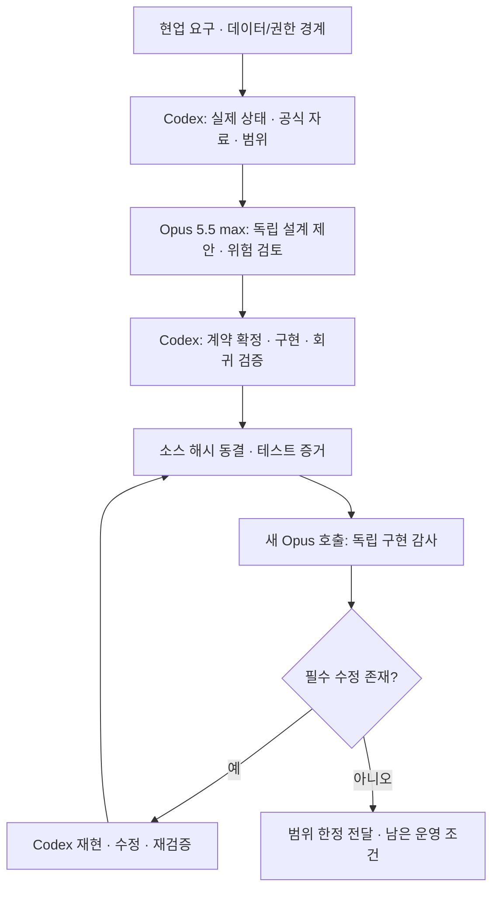

# Codex와 Opus 5.5 max의 설계·검증 오케스트레이션

이번 제작에서는 Codex가 환경 확인·공식 자료 조사·구현·재현 검증을 맡고, 실제 `claude-opus-5-5 --effort max` 호출이 공동 설계와 독립 구현 감사를 맡았습니다. 등록 모델명과 실제 `modelUsage` 응답을 확인하며 요청 모델을 조용히 대체하지 않습니다. 결과와 스냅샷 근거는 [검증 보고서](VERIFICATION.md)에 기록합니다.

## 반복할 수 있는 역할 분리



설계자의 의견 채택과 구현 감사 PASS는 서로 다른 증거입니다. 코드가 바뀌면 이전 소스 해시의 PASS를 재사용하지 않습니다. 독립 감사도 모델의 정적 검토이며 실제 테스트를 대신하지 않습니다.

## 재사용 명령

이미 설치·인증된 Claude CLI가 필요합니다. 템플릿은 [templates/advisors](../templates/advisors)에 있습니다. 다음 첫 단계는 로컬에서 소스와 해시를 묶을 뿐 외부로 전송하지 않습니다.

```powershell
powershell.exe -NoProfile -ExecutionPolicy Bypass -File scripts\check.ps1
powershell.exe -NoProfile -ExecutionPolicy Bypass -File scripts\build-review-packet.ps1 -OutputDirectory .omx\review-next
```

기업의 반출 조건을 확인하고 패킷에 자격증명·실제 개인정보·회사 비밀이 없는지 검토한 경우에만 승인된 외부 advisor를 호출합니다. 이번 제작의 패킷은 코드와 합성 테스트만 포함했습니다. 회사 자료를 자동으로 Claude CLI에 넘기는 기능은 없습니다. 외부 리뷰가 금지된 회사는 승인된 로컬/사내 모델로 동일 감사 계약을 수행하되 실제 모델과 검토 범위를 기록합니다.

```powershell
powershell.exe -NoProfile -ExecutionPolicy Bypass -File scripts\run-opus.ps1 -PromptPath .omx\review-next\prompt.md -OutputPath .omx\review-next\result.json
```

실행기는 모델/강도를 고정하고 도구·MCP·브라우저·슬래시 명령·hooks·세션 저장을 비활성화합니다. CLI의 외부 요청과 공급자 보관 정책 자체를 제어하는 것은 아니므로, 회사 데이터의 반출 정책·계약을 별도로 확인해야 합니다. 결과 JSON에서 `is_error`, 실제 모델 사용 이름, 최종 verdict와 완료 마커를 확인합니다. 실패/수정 필요를 성공으로 바꾸어 기록하지 않습니다.

실제 작업을 수행하는 런타임 AI의 모드는 별도입니다. 사용자에게 제공되는 모델은 `providers.py`의 회사 보안 정책을 거치며, 이 개발 단계의 외부 advisor가 운영 데이터에 접근하거나 실행을 승인하지 않습니다.
