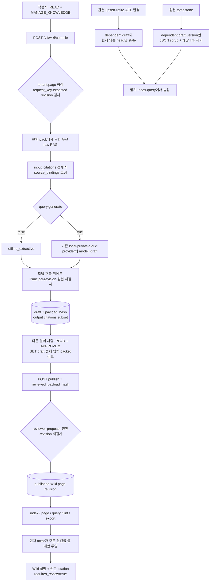

You are the actual Claude Opus 5.5 max design collaborator. The original human task is supplied verbatim. We are implementing a multi-industry AX starter with ontology/raw RAG and a governed persistent LLM Wiki, secure local/private/cloud model routing and domain upgrades.
This is a scoped DESIGN review of the supplied requirements, contracts, security-routing policy and operational design. It is not an executable code audit. The initial large design call timed out with is_error=true; it supplies no validation. Preserve model/effort; examine the complete selected sources below without claiming execution.
Evaluate whether hybrid Wiki should be included, its usefulness and limitations, raw/derived source separation, full input vs output citations, source-by-source historical/current AND ACL, independent human review bundle, stale/scrub lifecycle, current floor, external gateway boundary, adversarial derived imports, real company evaluation/upgrade path and cross-industry scope. Identify concrete contradictions or missing essential controls only in this design. Do not infer unseen implementation. Separate recommendation from required fix. Do not demand enterprise connectors, physical backup erasure, external audit signatures, semantic-quality certification or ROI already explicitly outside the local starter boundary; ensure these limits are clear.
Respond in Korean. Begin with exactly VERDICT: PASS or VERDICT: NEEDS_FIX. PASS means the supplied design is coherent within its stated local reference limits, never production/security certification. Include critical findings, bounded enhancement suggestions, and precise scope/limitations.
Frozen input manifest SHA-256: e9c2b6a9ccb57c2448cd51d4bec1bf91257c74a261a33e07b6ba8a88ac159b08

## File: docs/evidence/v0.3.0/user-request.md | SHA-256: 3be102d5ea949d30abf256a3b466eb1a5daa9b239191256c8556ae06bfbd8c96
```text
# 요청과 보존할 조건

사용자의 추가 요청: “여기에 rag 뿐아니라 llm wiki도 포함되어야할 것 같은데 어떻게 생각하는지 판단해서 같이 넣어놔”.

이전 요청의 범위는 여러 업종에 적용할 수 있는 AX 스타터, 업무 진단과 온톨로지 기반 RAG, 회사 보안 수준에 따른 local AI 또는 cloud gateway 선택, 업종별 심화·업그레이드 방법과 실제 기업·인터넷 자료 검토입니다. 실제 Opus 5.5 max와 공동 설계·검증해야 한다는 조건을 유지합니다.

기존 v0.2 배포 ZIP과 역사적 증거는 보존하고 Wiki 추가 뒤에는 새 검증과 새 독립 판정을 생성합니다. 실제 업무 데이터·회사 환경 검증이나 보안 인증 완료로 표현하지 않습니다.

```

## File: docs/WORK_PLAN_v0.3.md | SHA-256: fee97e32202574d334567f027b5407285e9cb65905c9190ccbc17a60935e6e11
```text
# v0.3 LLM Wiki 실행 계획

LLM Wiki는 AX의 업무 규정·예외·용어·판단 이유를 누적하는 파생 지식 계층으로 추가합니다. 원천 RAG는 현재 권한과 원문을 확인하고, 온톨로지는 업무 객체·관계를 연결하며, Wiki는 원문에 결속된 초안을 검토해 게시합니다. Wiki 페이지를 원천 문서로 섞거나 작업 승인 근거로 자동 승격하지 않습니다.

## 현재 기준선

v0.2 ZIP과 325개 테스트·Opus 5.5 max 최종 PASS는 해당 버전의 증거로 보존합니다. v0.3은 별도 검사·설치 실행·감사 입력·판정·배포본을 생성합니다.

## 실행 범위

1. Karpathy 원안과 OWASP 1차 자료, 기존 runtime을 대조해 기업용 hybrid 경계를 판단합니다.
2. 동일 SQLite에 회사별 페이지·초안·버전·검토·원천 결속을 저장합니다.
3. 짧은 transaction의 원천 snapshot → transaction 밖 컴파일 → 재인증·원천 재검사 후 초안 저장을 구현합니다.
4. 실제 서로 다른 human의 payload hash 검토를 거친 게시와 CAS·멱등·감사를 구현합니다.
5. 현재 원천까지 내려가는 질의, 권한별 index·backlink·lint, 정적 Markdown export를 제공합니다.
6. 원천 변경·ACL·retire는 사용을 차단하고 tombstone은 종속 초안·게시 버전의 본문을 논리 제거합니다.
7. offline extractive와 local/private/cloud model draft를 기존 모델 경로로 구분하며 전체 입력 원문을 권한·분류에 결속합니다.
8. API·CLI·합성 데모, 학습 다이어그램·업종 강화·회사 gold set 평가 서식을 제공합니다.
9. 전체 회귀·타입·정적 검사, 설치 wheel의 실제 HTTP/CLI·재시작, 독립 Sol 검토와 실제 Opus 5.5 max 재감사를 수행합니다.
10. 새 배포본의 모든 내부 파일과 감사·검사 manifest 해시를 대조합니다.

## 완료 경계

페이지의 생성 주장과 원문 인용 문자열이 존재한다는 사실을 의미 정확성으로 표현하지 않습니다. 회사의 현업 검토·gold set이 필요합니다. 원천 권한의 유효 조건은 각각의 원천에 대한 AND이고, group 이름의 단순 교집합과 다릅니다. 자기 생성 Wiki를 원천으로 재수집하는 운영 경로는 서버 정책과 provenance로 구분해야 합니다. 저장된 Markdown의 다운로드 이후 회수, SQLite/WAL·백업의 물리 삭제, 실제 기업 connector·IdP·모델 성능은 회사 환경에서 확인합니다.

## 역할

Codex는 통합·컴파일러·API·CLI·실행 증거를 담당합니다. Sol xhigh는 독립 설계, Wiki 저장·권한·생명주기 구현, 독립 검증을 구분해 담당합니다. Opus 5.5 max는 설계 반례와 고정한 최종 소스의 정적 감사를 담당합니다. 구현자와 최종 감사자를 구분합니다.

```

## File: docs/V03_GUIDE.md | SHA-256: 94f03d5a0731db13b128ebbd65ce4d096a9ef3a73dfb44c781595ac7a45f1a9e
```text
# v0.3: 원문 RAG와 LLM Wiki를 함께 운영하기

Wiki를 포함하는 편이 적절합니다. 자주 쓰는 업무 용어, 절차, 예외와 원문 간 관계를 지속적으로 정리할 수 있기 때문입니다. 원문 검색과 Wiki의 생성 지식을 별도 계층으로 유지하고, 기업별 gold set으로 효과를 확인합니다. 원안과 보안 자료의 판단 근거는 [LLM Wiki 가이드](LLM_WIKI_GUIDE.md)에 있습니다.

## 먼저 직접 실행하기

```powershell
uv sync --frozen
uv run ax wiki demo --domain procurement
uv run ax wiki demo --domain support
uv run ax wiki demo --domain hr
```

모델·외부 서비스 없이 합성 원문으로 실행됩니다. `self_review_blocked`, `persisted_after_restart`, `expired_source_hidden`, `export_non_authoritative`가 true인지 확인합니다. 자동으로 게시하는 이 데모의 역할은 테스트용 합성 사람입니다. 실제 회사의 사람이 검토했다는 증거로 사용하지 않습니다.

## 회사 파일과 서버를 연결하기

먼저 [회사 적용 가이드](V02_GUIDE.md)의 domain pack·신원·원문 계약·API 설정을 완료합니다. Wiki 작성자는 `READ+MANAGE_KNOWLEDGE`, 검토자는 실제 human의 `READ+APPROVE`가 필요합니다. 테넌트·목적·등급·모든 원천과 객체의 접근권한도 충족해야 합니다. 작성자와 검토자는 서로 다른 `effective_person_id`여야 합니다.

서버의 기본 `minimum_query_sensitivity`는 RESTRICTED(3)입니다. 작성자·검토자의 clearance와 모델 경로를 이 분류에 맞춥니다. 구매·지원의 기본 합성 init 계정은 INTERNAL(1)이므로 기본 설정에서 높은 분류의 Wiki 초안을 만들 수 없습니다. 아래 설정은 원문과 질문이 INTERNAL임을 확인한 **로컬 합성 데모**에서만 쓰는 예입니다. 실제 회사 정책을 낮추는 지침으로 사용하지 않습니다.

```json
{"mode":"offline","minimum_query_sensitivity":1}
```

회사별 provider 파일에 명시하고 `AX_PROVIDER_FILE`로 선택합니다. local은 loopback Ollama, private/cloud는 승인한 정확한 HTTPS 호스트·반출 승인·분류 ceiling·DLP 검사·별도 모델 credential을 요구합니다. 지역·보존·망·게이트웨이 실제 통제는 기존 [보안 모델](SECURITY_MODEL.md)과 도입 진단을 따릅니다.

`wiki-request.json`은 다음 형태입니다. page ID는 `tenant.local-id`이고 nested suffix는 거부합니다. 소스 ID는 원문 계약의 namespace를 따릅니다.

```json
{
  "request_key":"wiki-review-1",
  "page_id":"acme.review-policy",
  "title":"검토 절차",
  "kind":"procedure",
  "query":{"question":"검토 절차","purpose":"operations","object_id":"request-1","hops":1,"sensitivity":1,"generate":false},
  "expected_page_revision":0,
  "links":[]
}
```

```powershell
uv run ax wiki compile wiki-request.json
uv run ax wiki draft DRAFT_ID
# 실제 별도 검토자 credential을 AX_TOKEN에 지정한 뒤 실행합니다.
uv run ax wiki publish DRAFT_ID --reviewed-hash REVIEWED_PAYLOAD_HASH
uv run ax wiki index
uv run ax wiki query "검토 절차" --object-id request-1
uv run ax wiki page acme.review-policy
uv run ax wiki lint
uv run ax wiki export acme.review-policy
```

CLI는 기존 `AX_API_BASE`, `AX_TOKEN`, `AX_INPUT_ROOT`를 사용합니다. 기본 purpose는 operations입니다. export는 Markdown과 manifest를 담은 JSON 응답이며 서버가 임의 파일에 쓰지 않습니다. 같은 request_key의 정확한 재시도는 모델을 다시 호출하지 않고 저장된 초안을 반환하지만, 현재 원천·권한이 유효해야 합니다. 수정 게시에는 새로운 request_key와 현재 `expected_page_revision`이 필요합니다.

## 세 가지 근거를 검토하기

- `input_citations`: 컴파일러에 전달한 모든 원문. 검토자는 누락된 입력까지 읽습니다.
- `source_bindings`: 그 원문의 버전·본문/ACL/전체 문서 hash·객체·원천 계약에 대한 결속. 모든 원문에 과거와 현재의 권한을 적용합니다.
- `citations`: 모델 또는 추출기가 결과에 선택한 직접 인용. 연속 문자열 존재 검사는 의미적 타당성을 증명하지 않습니다.

검토 hash는 제목·본문·목적·페이지 revision·원문 입력·출처·links·분류·작성자·compiler mode를 포함합니다. 실제 검토자는 원문 의미, 예외, 상충과 삭제 대상을 확인한 뒤 hash를 게시합니다. `generate=false`는 offline_extractive, true는 모델 초안이며 실패 시 조용히 원문 추출로 대체하지 않습니다. Wiki query는 모델을 호출하지 않고 현재의 검토 페이지와 원문을 검색합니다. `generate=true`를 보내면 422입니다.

## 원문이 바뀌었을 때

원문 갱신·ACL 변경·retire는 해당 원문을 사용하는 현재 페이지와 초안을 stale로 처리합니다. 이전 revision만 의존하면 현재의 무관한 clean revision은 유지합니다. tombstone은 해당 원문에 의존한 **모든 버전과 초안**의 본문·제목·질문·인용을 live SQLite 레코드에서 제거합니다. 현재 revision이 삭제 대상이면 페이지를 숨기고 해당 identity의 재게시를 차단합니다. source 변경과 Wiki 전파는 같은 transaction이며 실패하면 함께 rollback합니다.

현재 권한·계약·분류 floor가 달라진 경우 조회 시에도 검사합니다. 더 낮은 분류로 작성된 페이지를 current server floor가 넘으면 재컴파일·재검토가 필요합니다. lint는 caller의 과거·현재 ACL 아래 보이는 `source_changed`만 보고하고 숨긴 페이지의 제목·개수를 노출하지 않습니다. 현재 구현은 의미 충돌, 자동 수정, 지속 감시나 재컴파일 예약을 수행하지 않습니다.

Wiki는 원문 `DomainPack.documents`에 들어가지 않고 직접 action evidence가 되지 않습니다. 알려진 Wiki export marker와 서버 `DataContractRegistry.evidence_roles`의 derived_output 계약은 원문 검색에서 제외합니다. 운영자가 marker를 제거하고 거짓 raw로 등록한 경우의 실제 기원을 hash만으로 인증하지는 못합니다.

## 분야를 강화하는 방법

L0는 source·owner·목적·접근·용어를 정합니다. L1은 반복 규정과 예외를 reviewed Wiki로 만들고 원문에 연결합니다. L2는 회사 gold set으로 RAG-only와 hybrid의 정답·유보·권한·삭제·지연·비용을 같은 조건에서 비교합니다. L3는 source watcher, 검토 대기열, 서명/백업·검색 인덱스 삭제, 의미 충돌 검토를 구현하고 실패를 재현합니다. L4는 현업 기준을 통과한 좁은 작업만 승인·시뮬레이션·복구 가능한 외부 connector에 연결합니다. 단계별 서식과 실습은 [Wiki 강화 가이드](LLM_WIKI_GUIDE.md)와 [업그레이드 가이드](UPGRADE_GUIDE.md)를 따릅니다.

다운로드된 export 회수, 디스크/WAL·백업의 물리 삭제, 외부 감사 서명, 기업 connector·실제 IdP·실제 모델 품질은 이 참조 구현으로 검증되지 않습니다. 회사의 평가·감사를 통과해야 운영 적용을 판단할 수 있습니다.

```

## File: docs/LLM_WIKI_GUIDE.md | SHA-256: 3dfc01da98cb69fcc181fe26518388cd904dbe9d24a82c452c6cd6172a8e55dc
```text
# RAG와 LLM Wiki를 함께 운영하는 가이드

현재 구현은 **원문 RAG + 사람이 검토한 LLM Wiki**를 함께 제공합니다. RAG가 현재 원문을 회수하고 권한·인용 경계를 집행하며, Wiki는 그 원문에 결속된 검토 초안을 누적합니다. Wiki 검색 결과도 최종 인용은 원문 문서이고, Wiki에서 action을 직접 만들거나 실행하지 않습니다.

구현된 보장은 원천 binding, 현재 ACL, 독립 검토, revision 충돌, 파생물 무효화와 논리 scrub입니다. 인용 문자열 검사가 의미의 정확성을 증명하지 않으며, 현재 lint도 의미적 모순·누락·오래된 업무 규칙을 자동 판정하지 않습니다. 실제 회사의 정확성 개선, KPI, 시간 절감과 ROI는 현업 gold set과 shadow 평가 전에는 미검증입니다.

## 왜 둘을 함께 두는가

[Karpathy의 LLM Wiki 아이디어](https://gist.github.com/karpathy/442a6bf555914893e9891c11519de94f)는 불변 원천, LLM이 갱신하는 Wiki, 유지 규칙을 분리합니다. 기업에서는 누적 종합이 유용하지만 Wiki를 원천으로 승격시키면 오래된 요약, 권한 누락, 자기인용이 반복될 수 있습니다. 이 구현은 원문을 권위 계층으로 남기고 Wiki를 검토된 파생 계층으로 둡니다.

| 방식 | 잘 맞는 용도 | 한계 | 파일럿 위치 |
|---|---|---|---|
| RAG-only | 최신 규정 확인, 단일 문서 질의, 원문 중심 감사 | 질문마다 여러 자료를 다시 연결해야 하며 이전 종합이 남지 않음 | 필수 기준선 |
| Wiki-only | 검토자가 누적된 페이지 구조와 설명을 살피는 내부 탐색 | 파생물이므로 현재 원문·ACL과 다시 대조해야 함 | 진단용 비교군 |
| Hybrid | 원문 증거와 누적 설명이 모두 필요한 반복 업무 | 검토, source binding, 무효화 운영이 필요 | 현재 기본 구조 |

Wiki-only는 평가 비교군으로 사용할 수 있지만 최종 증거 계층을 대체하지 않습니다.

## 구현 모듈 지도

| 모듈 | 현재 책임 |
|---|---|
| `wiki_contracts.py` | compile 요청, draft/page, source binding, index/query/lint/export 계약과 상태 enum |
| `wiki_api.py` | `/v1/wiki` HTTP route와 `generate=true` Wiki query 거부 |
| `wiki_cli.py` | 8개 HTTP 명령과 로컬 합성 `ax wiki demo` 진입점 |
| `wiki_compiler.py` | `offline_extractive` 또는 기존 provider를 쓰는 `model_draft` 생성 |
| `wiki_compile_flow.py` | page namespace, 권한, idempotency, revision, 모델 호출 전후 원천 재검사, draft 저장 |
| `wiki_publish_flow.py` | 검토 hash, 실제 사람·독립 검토, proposer/reviewer 신원, 현재 원천과 revision 재검사 |
| `wiki_policy.py` | Principal 재인증, 원천별 ACL AND, source binding, raw citation 검증 |
| `wiki_reads.py` | 현재 원천을 모두 볼 수 있는 page만 읽기·index에 투영하고 link/backlink 필터링 |
| `wiki_query_policy.py` | Wiki page scope·점수·인용 예산 선택과 `source_changed` lint 판정 |
| `wiki_query_export.py` | Wiki+원문 query, lint, 비권위 export와 Markdown export 차단 검사 |
| `wiki_schema.py` | 별도 Wiki schema, 지식 변경과 같은 transaction 안의 선택적 stale·scrub 전파와 감사 |
| `wiki_demo.py` | 조달·고객지원·인사 합성 pack의 무모델 compile-review-publish-query-export 데모 |
| `evidence_roles.py`, `evidence_policy.py` | 서버 registry의 raw/derived 역할과 알려진 Wiki export marker 차단 |
| `wiki.py`, `wiki_runtime.py` | 공개 `WikiService`와 내부 의존성 묶음 |

`WikiService`는 이 모듈들을 묶는 경계입니다. Wiki page와 draft는 기존 raw knowledge table이 아니라 별도 Wiki table에 저장됩니다.

## 실제 요청 흐름



| 단계 | 결정적 검사 | 모델 역할 | 사람 역할 | 실패 경계 |
|---|---|---|---|---|
| compile 시작 | 현재 credential, `READ+MANAGE_KNOWLEDGE`, purpose, page namespace, request idempotency, expected revision | 없음 | 승인된 질문·메타데이터 제출 | 권한·namespace·revision·request 충돌 거부 |
| raw 검색 | 문서·객체별 tenant, group, clearance, purpose, 유효기간, current contract binding | 없음 | 원천과 질의 범위 선정 | 인용할 raw 근거가 없으면 draft 생성 거부 |
| compile | 입력 원문을 `input_citations`와 `source_bindings`로 모두 보존하고 그 안에서 출력 `citations` 선택; 각 집합 최대 10개 | 추출형 조립 또는 기존 provider의 생성 | 아직 게시 승인 아님 | 새 citation·자기 page citation·변경 원천 거부 |
| draft 저장 | 모델 호출 전후 Principal·원천·revision 재검사, 최고 분류 계산 | 결과는 review candidate | `GET draft`로 전체 입력 packet과 hash 확인 | 호출 중 원천·권한 변경 시 `wiki_source_stale` |
| publish | hash 일치, 실제 human, 다른 subject와 `person_id`, `READ+APPROVE`, 양쪽의 현재 원천 접근, revision | 없음 | 원문 의미·예외·상충을 직접 검토 | 자기 승인·서비스 승인·stale source·revision 충돌 거부 |
| read/query | 현재 credential, purpose, page classification, 모든 source binding·원천 ACL | Wiki query는 모델을 호출하지 않음 | `requires_review=true` 결과 검토 | 하나라도 원천을 못 보면 page 전체를 숨김 |
| knowledge 변경 | 변경 document dependency와 head의 실제 current revision 의존성 조회 | 없음 | 정정·ACL·삭제 범위 승인 | 의존 draft/current head만 stale, tombstone은 의존 version/draft만 scrub; transaction rollback 시 Wiki도 rollback |

## HTTP 계약

### compile 요청

`POST /v1/wiki/compile`은 다음 `WikiCompileRequest`를 받습니다.

```json
{
  "request_key": "wiki-review-v1",
  "page_id": "acme.review-policy",
  "title": "검토 절차",
  "kind": "procedure",
  "query": {
    "question": "검토 절차",
    "purpose": "operations",
    "object_id": null,
    "top_k": 4,
    "hops": 1,
    "sensitivity": 1,
    "generate": false
  },
  "expected_page_revision": 0,
  "links": []
}
```

- `kind`: `source`, `entity`, `concept`, `synthesis`, `procedure`
- `page_id`: `<tenant>.<점 없는 suffix>`입니다. 다른 tenant prefix, 빈 suffix, 중첩 suffix는 조회 전에 404로 닫힙니다.
- `expected_page_revision`: 새 page는 `0`, 갱신은 현재 published revision입니다.
- `links`: 최대 20개이며 같은 page namespace 형식을 사용합니다. 읽을 때 보이지 않는 대상 link와 backlink는 응답에서 제거됩니다.
- `request_key`: 같은 tenant·proposer 안의 멱등 키입니다. 같은 요청은 저장 draft를 재사용하고 다른 payload 재사용은 409입니다.
- `query.purpose`: 생략 시 `operations`입니다.
- `query.generate=false`: provider를 호출하지 않는 `offline_extractive`입니다.
- `query.generate=true`: 기존 `ProviderConfig`를 통해 설정된 Ollama local, private gateway 또는 cloud gateway 생성 경로를 사용하고 결과를 `model_draft`로 기록합니다.

생성 경로에는 `query`와 서버가 검색한 raw answer가 전달됩니다. page title, kind, links는 로컬 payload metadata이며 `generate()` 입력에 추가되지 않습니다.

민감도 숫자는 `0=PUBLIC`, `1=INTERNAL`, `2=CONFIDENTIAL`, `3=RESTRICTED`입니다.

### route 표

| HTTP | 요청 | 반환 | 핵심 경계 |
|---|---|---|---|
| `POST /v1/wiki/compile` | `WikiCompileRequest` | `WikiDraft` | raw 근거 필수, 전후 원천 재검사, CAS·idempotency |
| `GET /v1/wiki/drafts/{id}` | path ID | `WikiDraft` | proposer·허용된 manager 또는 독립 HUMAN reviewer가 현재 원천을 모두 볼 때 반환; reviewer는 `READ+APPROVE`, `READ`만 있으면 403 |
| `POST /v1/wiki/drafts/{id}/publish` | `reviewed_payload_hash` | `WikiPage` | 독립된 실제 사람의 검토, 현재 source와 revision 재검사; 이전 revision 게시 재시도는 409 |
| `GET /v1/wiki/index` | `purpose` query | `WikiIndexEntry[]` | 현재 actor에게 보이는 page·link·backlink만 반환 |
| `GET /v1/wiki/pages/{id}` | `purpose` query | `WikiPage` | 모든 원천 live ACL과 binding을 다시 검사 |
| `POST /v1/wiki/query` | `Query` | `WikiAnswer` | `generate=true`는 422; page와 raw 결과를 로컬 조립 |
| `GET /v1/wiki/lint` | `purpose` query | `WikiLintFinding[]` | 현재는 `source_changed`만 반환 |
| `GET /v1/wiki/pages/{id}/export` | `purpose` query | `WikiExport` | non-authoritative manifest, marker, 모든 Markdown 이미지·HTML tag 차단 |

## CLI 사용

Wiki CLI도 기존 `AX_API_BASE`, `AX_TOKEN`, 로컬 입력 경계를 사용합니다. `compile` 파일은 위 JSON과 같은 요청입니다.

```powershell
uv run ax wiki compile .runtime\company-pilot\wiki-compile.json
uv run ax wiki draft <DRAFT_ID>
uv run ax wiki publish <DRAFT_ID> --reviewed-hash <PAYLOAD_HASH>

uv run ax wiki index
uv run ax wiki page acme.review-policy
uv run ax wiki query "검토 절차" --sensitivity 1
uv run ax wiki lint
uv run ax wiki export acme.review-policy
uv run ax wiki demo --domain procurement
```

`index`, `page`, `lint`, `export`의 기본 purpose는 `operations`이며 필요하면 `--purpose audit`를 붙입니다. `query`도 기본 `operations`, 기본 sensitivity `2`이고 `--object-id`를 받을 수 있습니다. CLI `wiki query`에는 생성 옵션이 없습니다.

`demo`는 `procurement`, `support`, `hr` 중 하나를 받아 각 분야의 합성 pack으로 compile, 자기검토 차단, 독립 게시, 재시작 뒤 조회, 만료 source 숨김과 비권위 export를 실행합니다. `generate=false`인 `offline_extractive` 경로라 모델을 호출하지 않으며 결과의 `synthetic=true`, `model_executed=false`를 실제 회사 성과로 해석하지 않습니다. 회사 pilot 전체 순서는 [v0.3 실행 가이드](V03_GUIDE.md)를 따릅니다.

`publish`는 compile 작성자와 다른 실제 사람의 token으로 실행해야 합니다. `export`는 파일을 자동 저장하지 않고 `text`와 `manifest`가 든 JSON을 표준 출력으로 반환합니다. 호출자가 저장 위치, 파일 ACL, 보존과 삭제를 책임집니다.

## draft·게시·분류 경계

구현된 draft 상태는 `draft`, `published`, `stale`, `scrubbed`이고 page head 상태는 `published`, `stale`, `scrubbed`입니다. 읽기·index·query는 `published` head만 대상으로 하며, stale·scrubbed draft/page는 일반 조회에서 보이지 않습니다.

page classification은 server query floor, query sensitivity, raw answer와 citation, 원천 문서와 연결 객체의 민감도, compiler 결과 중 가장 높은 등급입니다. 작성자와 reviewer 모두 필요한 원천을 각자 볼 수 있고 page classification 이상의 clearance를 가져야 합니다. 여러 원천의 group 이름을 하나의 교집합 ACL로 만들지 않고, 각 원천에 대해 현재 actor의 tenant·group·clearance·purpose·`READ`를 차례로 검사합니다. 서로 다른 group의 원천도 한 사람이 각 group을 모두 보유하면 함께 사용할 수 있습니다.

publish는 `payload_hash`가 검토한 payload와 `compiler_mode`에 결속됐는지 확인합니다. reviewer는 human이고 `READ+APPROVE`가 있어야 하며 proposer와 subject 또는 유효 `person_id`가 같으면 거부됩니다. proposer의 actor kind·person binding이 바뀐 draft도 게시할 수 없습니다.

독립 reviewer는 publish 전에 `GET /v1/wiki/drafts/{id}`로 `input_citations`, `source_bindings`, body와 출력 `citations`가 든 전체 packet을 읽을 수 있습니다. reviewer는 현재 원천을 모두 볼 수 있는 HUMAN이며 `READ+APPROVE`를 가져야 합니다. `READ`만 가진 사람에게는 draft를 공개하지 않습니다.

세 provenance 필드는 역할이 다릅니다.

| 필드 | 담는 범위 | 쓰임 |
|---|---|---|
| `input_citations` | 컴파일러가 실제로 받은 raw citation 전체, 최대 10개 | 검토자가 누락·상충·선택 편향을 확인 |
| `source_bindings` | 모든 입력 원천의 문서·내용·ACL·계약 hash, object IDs, ACL snapshot과 유효기간, 최대 10개 | 게시·읽기 때 전체 입력의 현재 권한과 무결성을 다시 검사 |
| `citations` | compiler 출력이 body 근거로 선택한 `input_citations`의 부분집합, 최대 10개 | page export와 최종 Wiki query 인용 후보 |

서버 query floor가 저장된 draft나 page classification보다 높아지면 낮은 분류의 draft 재사용·조회·게시에는 409 `wiki_recompile_required`가 발생하고, 낮은 분류의 published page는 읽기·index·query에서 숨겨집니다. 새 request key와 현재 `expected_page_revision`으로 다시 compile하고 독립 검토해야 합니다.

자동 검사는 citation의 document ID, URI, version, content·ACL hash, object IDs, sensitivity와 quote가 서버가 검색한 raw citation에 포함되는지 확인합니다. 이 검사는 인용 발명과 자기 page 인용을 막지만, body의 모든 문장이 원문을 올바르게 해석했는지 증명하지 않습니다. reviewer가 원문을 읽고 의미·예외·시점·상충을 확인해야 합니다.

## Wiki query는 원문 인용을 유지한다

`POST /v1/wiki/query`는 현재 raw RAG와 현재 actor에게 보이는 Wiki page를 함께 검색합니다. `object_id`와 `hops`로 계산한 scope 안에 page의 **모든** `source_bindings.object_ids`가 들어가야 그 page가 후보가 됩니다. 즉 일부 입력 원천만 scope에 들어오는 page는 제외됩니다. 후보는 title과 body의 keyword 점수로 정렬한 뒤 `top_k`와 최종 인용 10개 예산 안에서 선택합니다. 선택된 page 본문과 raw 답변을 로컬에서 이어 붙이고 `mode=model_draft`, `requires_review=true`로 반환하지만 provider 모델을 호출하지는 않습니다.

각 `WikiPageHit`는 발췌문뿐 아니라 그 page의 `input_citations`와 `source_bindings`를 반환하므로 출력 인용보다 넓은 실제 컴파일 입력과 ACL 결속을 확인할 수 있습니다. 최종 `answer.citations`는 최대 10개입니다. page를 고를 때 각 page의 출력 `citations`가 예산에 모두 들어가는지 먼저 검사하고, 선택된 page 인용을 우선 배치한 뒤 남은 예산을 현재 raw RAG citation으로 채웁니다. document ID·content hash로 중복을 제거하며 Wiki page ID는 citation document ID가 되지 않습니다. page 링크는 탐색용이고 증거가 아니며, Wiki query 결과에서 action proposal·approve·execute로 직접 이어지는 경로는 없습니다. action이 필요하면 기존 action 계약과 별도 권한·검토 흐름을 사용합니다.

`Query.generate=true`를 Wiki query API에 보내면 HTTP 422와 `wiki_query_generation_not_supported`가 반환됩니다. 생성은 compile 단계에서만 선택할 수 있고, 게시에는 독립 검토가 필요합니다.

## source role과 자기재수집 경계

관리 원천의 역할은 문서가 스스로 주장하지 않고 서버의 `DataContractRegistry.evidence_roles`가 `(tenant, contract_id)`별로 정합니다.

- `raw_source`: 현재 raw retrieval 후보입니다.
- `derived_output`: DB에는 유지하지만 raw current pack에서 제외합니다.
- role을 생략한 기존 계약은 v0.2 호환을 위해 `raw_source`로 해석됩니다.
- role 항목은 등록된 계약만 가리킬 수 있고 같은 계약에 중복할 수 없습니다.

Wiki export 본문은 `AX_DERIVED_WIKI_V1` marker로 시작합니다. 이 marker가 본문 맨 앞에 남아 있으면 운영자가 export를 잘못 raw 계약으로 넣어도 raw retrieval에서 제외됩니다. 정상 운영에서는 export를 다시 반입할 계약도 `derived_output`으로 등록합니다.

이 통제는 알려진 export 형식의 재수집을 막는 방어입니다. 운영자가 marker를 제거하고 문서를 raw 계약으로 잘못 등록하면 현재 구현이 그 문서의 실제 기원이나 의미를 인증해 자동 차단하지는 못합니다. 승인된 connector, source authentication, 계약 변경 승인과 ingestion 검토가 필요합니다.

export manifest는 `non_authoritative=true`, page revision·hash, purpose, classification, raw source hash, export·만료 시각과 caller fingerprint를 담습니다. inline·reference·angle-bracket·protocol-relative를 포함한 모든 Markdown 이미지 구문과 HTML tag가 title 또는 body에 있으면 export를 422 `wiki_export_unsafe_markup`로 거부합니다. 이 검사는 임의 Markdown viewer의 렌더링 안전을 인증하지 않습니다. 이미 내려받은 export, 외부 저장소 복사본, 백업이나 모델 제공자 보존물을 서버가 회수·삭제하지는 못합니다.

## 원천 변경·ACL·삭제 전파

| 원천 사건 | 현재 구현 동작 | 읽기 결과 | 남은 운영 책임 |
|---|---|---|---|
| upsert·retire·ACL 변경 등 knowledge mutation | 같은 SQLite transaction에서 그 원천에 의존한 draft를 `stale`로 표시하고, **현재 revision이 실제로 의존할 때만** page head를 `stale`로 표시 | 영향 draft와 영향 current page를 숨김; 그 원천이 과거 revision에만 있으면 독립 current page 유지 | 새 원천으로 새 request key·현재 revision의 draft를 다시 compile·review |
| tombstone | 모든 의존 draft와 의존 page revision의 JSON만 `NULL`로 scrub하고 해당 revision link 제거; current revision이 의존하면 head도 `scrubbed` | 영향 current head는 404·page ID 재사용 거부; 독립된 clean current revision은 계속 사용 | WAL·파일·snapshot·백업·외부 export의 실제 삭제 증거 |
| mutation transaction rollback | Wiki invalidation과 감사도 함께 rollback | 기존 page 유지 | 실패 원인 수정 후 전체 batch 재시도 |
| hook 밖의 원천·binding·ACL 변화 | 매 read에서 source binding과 live ACL을 다시 검사 | 하나라도 불일치하면 page 전체를 숨김 | 우회 변경을 금지하고 정상 knowledge 경로 사용 |
| 접근 가능한 원천의 document JSON만 조용히 변경 | page가 아직 published라면 lint가 `source_changed` 후보를 반환 | live read는 hash 불일치로 숨김 | 손상 조사, 정상 수정·무효화, 독립 검토 |

tombstone scrub은 live Wiki table cell의 title·body·query·citation 같은 JSON을 제거합니다. source dependency와 최소 감사 메타데이터는 추적을 위해 남습니다. 이것을 SQLite page, WAL, filesystem snapshot, backup, 다운로드 export와 외부 provider의 물리 삭제 증거로 확대하지 않습니다.

같은 reviewer가 이미 게시된 draft를 같은 hash로 재시도할 때 그 revision이 여전히 current면 멱등 결과를 돌려줍니다. 이후 revision이 게시되어 앞 revision이 superseded됐다면 409 `wiki_publish_replay_superseded`를 반환하며 최신 page를 과거 게시의 결과처럼 돌려주지 않습니다.

## index·lint의 정확한 한계

index는 page ID, title, kind, revision, classification, link와 backlink를 반환합니다. 현재 actor가 볼 수 없는 page는 수와 제목뿐 아니라 link·backlink에서도 제거되어 graph metadata로 숨은 page가 드러나지 않게 합니다.

현재 lint finding code는 `source_changed` 하나뿐입니다. actor가 볼 수 있고 head가 아직 published인 page에서 source document JSON hash가 binding과 달라진 경우를 찾습니다. 다음 항목은 현재 lint가 자동 검증하지 않습니다.

- Wiki body의 의미 정확성, 인용 entailment, 모순 해결
- orphan page, 빠진 backlink, 중복 개념, 용어 품질
- 회사 규정의 실제 효력, 최신 업무 의미, 현업 예외
- poisoning 의도, 검색조작 성공 여부, 기업 KPI·ROI
- 이미 stale·scrubbed 또는 live ACL·binding 실패로 숨겨진 page의 상세 원인

따라서 빈 lint 결과는 Wiki가 정확하거나 최신이라는 인증이 아닙니다.

## 실제 회사 gold set으로 세 방식을 평가한다

같은 source snapshot, identity·ACL, 질의, provider·prompt·policy, rubric을 고정하고 RAG-only, Wiki-only, Hybrid를 비교합니다. 개발 case와 숨겨 둔 최종 case를 분리하고 현업 소유자가 기대 답, 허용·금지 원천, 유보 조건과 위험한 오답을 확인합니다.

현재 `/v1/ask`는 RAG-only 기준선이고 `/v1/wiki/query`는 Hybrid 경로입니다. 공개 Wiki-only query route는 없습니다. Wiki-only 평가는 보이는 page body와 그 page가 보존한 raw citation만 쓰는 별도 ablation harness에서 수행하고, 그 결과를 현재 운영 API의 기능으로 보고하지 않습니다.

| 범주 | 측정 질문 | 비교 방법 |
|---|---|---|
| 답변 품질 | 현업 정답과 의미가 맞고 범위·예외를 보존했는가 | 같은 rubric의 현업 blind review |
| 근거 충실도 | 문장이 raw citation에 의해 지지되고 필요한 원천을 빠뜨리지 않았는가 | claim별 entailment·source coverage 검토 |
| 종합 능력 | 여러 원천의 관계와 모순을 정확히 드러냈는가 | multi-source·conflict case 비교 |
| 유보 | 근거·권한이 부족할 때 답을 만들지 않았는가 | 필요한 유보와 불필요한 유보 분리 |
| 최신성 | 갱신·만료·ACL 변경·삭제 뒤 이전 내용을 쓰지 않았는가 | 사건 전후 재실행과 dependency 대조 |
| 오염 내성 | derived export·poisoning·검색조작이 raw 근거나 정책이 되는가 | 격리된 adversarial case |
| 운영성 | 지연·provider 사용량·인프라 비용·검토·재작업 시간은 얼마인가 | 동일 case와 기간의 원값 비교 |

권한 밖 노출, retire·tombstone 원천 재사용, raw 근거 없는 고영향 설명, derived output의 raw 재수집, 삭제·ACL 사건의 전파 누락은 평균 품질과 별개인 veto입니다. 목표치는 회사 기준선으로 정하고 합성 결과를 실제 성과로 보고하지 않습니다.

## 분야 지식을 강화하는 순서

1. 읽기 중심 업무 하나와 금지된 자동화를 정합니다.
2. 원천 owner, 효력일, 예외, ACL, 삭제·정정 사건을 조사하고 `evidence_roles`를 포함한 server registry를 승인합니다.
3. RAG-only 기준선과 실제 회사 gold set을 만듭니다.
4. `offline_extractive`로 source·procedure page부터 만들고 독립 reviewer가 원문 의미를 확인합니다.
5. 다중 원천 synthesis가 필요한 경우에만 `generate=true` compile을 추가하고 provider 반출 정책을 다시 확인합니다.
6. RAG-only, Wiki-only, Hybrid를 같은 case로 비교하고 오류를 원천 계약, 분야팩, query, Wiki body 또는 검토 절차에 배정합니다.
7. dry run과 read-only shadow에서 stale·scrub·marker·export 보존, 검토 시간과 rollback을 확인합니다. action 자동화는 별도 승인 흐름에서 평가합니다.

## 수정 실습 3개

### 실습 1: 새 page kind를 추가한다

`WikiKind`에 회사가 필요한 종류 하나를 추가하고 compile JSON, API round-trip, index 반환을 수정합니다. `wiki_contracts.py`와 관련 테스트만으로 계약 변경을 시작하고 기존 kind의 직렬화가 바뀌지 않는지 확인합니다.

완료 조건: 새 kind의 유효 요청과 알 수 없는 kind의 거부, publish 후 index 표시, 기존 page read 회귀를 검증합니다. kind 추가가 새로운 권한이나 source trust를 부여해서는 안 됩니다.

### 실습 2: 결정적인 lint finding을 추가한다

의미적 모순처럼 모델 판단이 필요한 검사가 아니라, 보이는 page의 끊어진 link처럼 결정적으로 재현할 수 있는 finding을 설계합니다. `wiki_query_policy.py`의 판정, `WikiLintFinding.code`, `wiki_query_export.py`의 `lint_wiki`, 권한별 link visibility와 테스트를 함께 수정합니다.

완료 조건: 보이는 끊어진 link는 탐지하고 권한 때문에 숨은 page ID는 finding으로 누출하지 않습니다. 기존 `source_changed` 동작과 빈 lint의 의미도 유지합니다.

### 실습 3: 한 분야의 raw/derived 경계를 강화한다

회사 분야의 raw 계약과 Wiki export 계약을 나누고 `DataContractRegistry.evidence_roles`에 각각 `raw_source`, `derived_output`을 지정합니다. marker가 있는 export, derived role 문서, marker를 제거한 잘못된 raw 등록을 별도 case로 만듭니다.

완료 조건: 앞의 두 derived case는 raw 검색에서 제외되고, marker를 제거한 오등록은 현재 구현이 인증해 막지 못한다는 한계를 결과에 남깁니다. RAG-only·Wiki-only·Hybrid의 같은 gold case와 권한·삭제 veto도 다시 실행합니다.

## 운영 서식

- [Wiki page·draft 검토서](../templates/wiki/wiki-page.md)
- [source role·compile 검토서](../templates/wiki/ingest-review.md)
- [Wiki 수명주기 전파 검토서](../templates/wiki/lifecycle-review.md)
- [회사 Wiki gold set·비교 평가서](../templates/wiki/company-gold-set.md)

## 근거와 적용 경계

- [Karpathy, LLM Wiki](https://gist.github.com/karpathy/442a6bf555914893e9891c11519de94f): 지속 관리 Wiki 패턴의 원문이며 기업 보안·성능 증거는 아닙니다.
- [OWASP RAG Security Cheat Sheet](https://cheatsheetseries.owasp.org/cheatsheets/RAG_Security_Cheat_Sheet.html): ingestion, provenance, access inheritance, deletion, index·query integrity와 fail-closed 통제.
- [OWASP LLM08:2025 Vector and Embedding Weaknesses](https://genai.owasp.org/llmrisk/llm082025-vector-and-embedding-weaknesses/): permission-aware store, source validation, 결합 데이터 분류·검토와 retrieval log.
- [OWASP Top 10 for Agentic Applications, ASI06](https://genai.owasp.org/download/52117/?tmstv=1765059207): persistent memory poisoning, 자기강화 오염 방지, provenance·사람 검토·rollback·격리.
- [OWASP LLM Prompt Injection Prevention Cheat Sheet](https://cheatsheetseries.owasp.org/cheatsheets/LLM_Prompt_Injection_Prevention_Cheat_Sheet.html): 외부 문서의 간접 prompt injection, RAG poisoning, 입력·출력·행위 검사.

이 문서의 구현 설명은 현재 source와 테스트가 보장하는 범위입니다. 의미 정확성, 실제 기업 적용 효과, 보안 인증과 ROI는 별도 현장 증거가 필요합니다.

```

## File: src/ax_starter/wiki_contracts.py | SHA-256: 5b5ba5504a8aa8da70a60271636744f359d3d0dabb52050d204082312bbd3323
```text
from collections.abc import Callable
from enum import StrEnum
from typing import Literal, Protocol

from pydantic import AwareDatetime, Field

from ax_starter.common import Access, ActorKind, Contract, Identifier, Purpose, Sensitivity
from ax_starter.retrieval import Answer, Citation, Query


class WikiKind(StrEnum):
    SOURCE = "source"
    ENTITY = "entity"
    CONCEPT = "concept"
    SYNTHESIS = "synthesis"
    PROCEDURE = "procedure"


class WikiDraftState(StrEnum):
    DRAFT = "draft"
    PUBLISHED = "published"
    STALE = "stale"
    SCRUBBED = "scrubbed"


class WikiHeadState(StrEnum):
    PUBLISHED = "published"
    STALE = "stale"
    SCRUBBED = "scrubbed"


class WikiCompileRequest(Contract):
    request_key: Identifier
    page_id: Identifier
    title: str = Field(min_length=1, max_length=200)
    kind: WikiKind
    query: Query
    expected_page_revision: int = Field(default=0, ge=0)
    links: tuple[Identifier, ...] = Field(default=(), max_length=20)


class WikiCompilation(Contract):
    body: str = Field(min_length=1, max_length=8_000)
    citations: tuple[Citation, ...] = Field(min_length=1, max_length=10)
    compiler_mode: Literal["offline_extractive", "model_draft"]
    sensitivity: Sensitivity


class WikiCompiler(Protocol):
    def __call__(self, request: WikiCompileRequest, answer: Answer) -> WikiCompilation: ...


WikiCompilerCallable = Callable[[WikiCompileRequest, Answer], WikiCompilation]


class WikiSourceBinding(Contract):
    document_id: Identifier
    document_sha256: str = Field(pattern=r"^[a-f0-9]{64}$")
    content_sha256: str = Field(pattern=r"^[a-f0-9]{64}$")
    access_sha256: str = Field(pattern=r"^[a-f0-9]{64}$")
    source_identifier: Identifier
    source_version: Identifier
    object_ids: tuple[Identifier, ...] = Field(min_length=1, max_length=30)
    access_snapshot: Access
    valid_until: AwareDatetime
    contract_id: Identifier | None = None
    contract_version: Identifier | None = None
    contract_sha256: str | None = Field(default=None, pattern=r"^[a-f0-9]{64}$")


class WikiDraftPayload(Contract):
    tenant: Identifier
    request_key: Identifier
    page_id: Identifier
    title: str = Field(min_length=1, max_length=200)
    body: str = Field(min_length=1, max_length=8_000)
    kind: WikiKind
    purpose: Purpose
    query: Query
    expected_page_revision: int = Field(ge=0)
    links: tuple[Identifier, ...] = Field(max_length=20)
    citations: tuple[Citation, ...] = Field(min_length=1, max_length=10)
    input_citations: tuple[Citation, ...] = Field(min_length=1, max_length=10)
    source_bindings: tuple[WikiSourceBinding, ...] = Field(min_length=1, max_length=10)
    classification: Sensitivity
    server_query_floor: Sensitivity
    proposer: Identifier
    proposer_actor_kind: ActorKind
    proposer_person_id: Identifier | None


class WikiDraft(Contract):
    id: Identifier
    request_key: Identifier
    request_sha256: str = Field(pattern=r"^[a-f0-9]{64}$")
    payload: WikiDraftPayload
    payload_hash: str = Field(pattern=r"^[a-f0-9]{64}$")
    compiler_mode: Literal["offline_extractive", "model_draft"]
    state: WikiDraftState
    created_at: AwareDatetime
    published_revision: int | None = Field(default=None, ge=1)
    reviewer: Identifier | None = None
    reviewer_person_id: Identifier | None = None


class WikiPage(Contract):
    tenant: Identifier
    request_key: Identifier
    page_id: Identifier
    version_id: Identifier
    revision: int = Field(ge=1)
    title: str = Field(min_length=1, max_length=200)
    body: str = Field(min_length=1, max_length=8_000)
    kind: WikiKind
    purpose: Purpose
    query: Query
    expected_page_revision: int = Field(ge=0)
    links: tuple[Identifier, ...] = Field(max_length=20)
    citations: tuple[Citation, ...] = Field(min_length=1, max_length=10)
    input_citations: tuple[Citation, ...] = Field(min_length=1, max_length=10)
    source_bindings: tuple[WikiSourceBinding, ...] = Field(min_length=1, max_length=10)
    classification: Sensitivity
    server_query_floor: Sensitivity
    compiler_mode: Literal["offline_extractive", "model_draft"]
    payload_hash: str = Field(pattern=r"^[a-f0-9]{64}$")
    proposer: Identifier
    proposer_person_id: Identifier | None
    reviewer: Identifier
    reviewer_person_id: Identifier
    published_at: AwareDatetime


class WikiIndexEntry(Contract):
    page_id: Identifier
    title: str
    kind: WikiKind
    revision: int = Field(ge=1)
    classification: Sensitivity
    links: tuple[Identifier, ...]
    backlinks: tuple[Identifier, ...]


class WikiPageHit(Contract):
    page_id: Identifier
    title: str
    excerpt: str
    revision: int = Field(ge=1)
    classification: Sensitivity
    source_bindings: tuple[WikiSourceBinding, ...] = Field(min_length=1, max_length=10)
    input_citations: tuple[Citation, ...] = Field(min_length=1, max_length=10)


class WikiAnswer(Contract):
    pages: tuple[WikiPageHit, ...]
    answer: Answer


class WikiLintFinding(Contract):
    page_id: Identifier
    code: Literal["source_changed"]


class WikiExportSource(Contract):
    document_id: Identifier
    document_sha256: str = Field(pattern=r"^[a-f0-9]{64}$")
    content_sha256: str = Field(pattern=r"^[a-f0-9]{64}$")
    access_sha256: str = Field(pattern=r"^[a-f0-9]{64}$")


class WikiExportManifest(Contract):
    non_authoritative: Literal[True] = True
    tenant: Identifier
    page_id: Identifier
    page_revision: int = Field(ge=1)
    page_hash: str = Field(pattern=r"^[a-f0-9]{64}$")
    purpose: Purpose
    classification: Sensitivity
    sources: tuple[WikiExportSource, ...] = Field(min_length=1, max_length=10)
    exported_at: AwareDatetime
    expires_at: AwareDatetime
    caller_fingerprint: str = Field(pattern=r"^[a-f0-9]{64}$")


class WikiExport(Contract):
    text: str = Field(min_length=1)
    manifest: WikiExportManifest

```

## File: src/ax_starter/providers.py | SHA-256: dfcc8898cc5fa16799e36eabd71b2bed6a9dd585393d38ea1f00146821ae03d9
```text
import ipaddress
import json
import re
import socket
from enum import StrEnum
from typing import Final, assert_never
from urllib.parse import urlsplit

import httpx2
from pydantic import Field, model_validator
from pydantic_core import PydanticCustomError

from ax_starter.common import AXError, Contract, Sensitivity
from ax_starter.retrieval import Answer, Query


class ProviderMode(StrEnum):
    OFFLINE = "offline"
    LOCAL = "local"
    PRIVATE = "private_gateway"
    CLOUD = "cloud_gateway"


class ProviderConfig(Contract):
    mode: ProviderMode = ProviderMode.OFFLINE
    endpoint: str | None = Field(default=None, max_length=500)
    model: str | None = Field(default=None, max_length=120)
    approved_hosts: tuple[str, ...] = Field(default=(), max_length=10)
    egress_approved: bool = False
    minimum_query_sensitivity: Sensitivity = Sensitivity.RESTRICTED
    max_prompt_bytes: int = Field(default=64_000, ge=1000, le=128_000)

    @model_validator(mode="after")
    def endpoint_boundary(self) -> "ProviderConfig":
        if self.mode == ProviderMode.OFFLINE:
            return self
        if not self.endpoint or not self.model:
            raise PydanticCustomError("provider_incomplete", "endpoint와 model을 명시해야 합니다")
        url = urlsplit(self.endpoint)
        if not url.hostname or url.username or url.password or url.query or url.fragment:
            raise PydanticCustomError("unsafe_endpoint", "허용되지 않은 endpoint 형식")
        match self.mode:
            case ProviderMode.LOCAL:
                try:
                    address = ipaddress.ip_address(url.hostname)
                except ValueError as exc:
                    raise PydanticCustomError(
                        "local_requires_ip", "local은 loopback IP만 허용합니다"
                    ) from exc
                if not address.is_loopback or url.scheme not in ("http", "https"):
                    raise PydanticCustomError(
                        "local_requires_loopback", "local은 loopback에만 연결합니다"
                    )
            case ProviderMode.PRIVATE | ProviderMode.CLOUD:
                if url.scheme != "https" or url.hostname not in self.approved_hosts:
                    raise PydanticCustomError(
                        "gateway_not_allowlisted", "HTTPS 및 정확한 호스트 허용 목록이 필요합니다"
                    )
            case ProviderMode.OFFLINE:
                pass
            case unreachable:
                assert_never(unreachable)
        return self


SENSITIVE_PATTERNS: Final = (
    re.compile(r"(?<![A-Za-z0-9_])sk-[A-Za-z0-9_-]{12,}(?![A-Za-z0-9_])"),
    re.compile(r"(?<![A-Za-z0-9_])gh[pousr]_[A-Za-z0-9]{20,}(?![A-Za-z0-9_])"),
    re.compile(r"(?<![A-Za-z0-9_])github_pat_[A-Za-z0-9_]{20,}(?![A-Za-z0-9_])"),
    re.compile(r"(?<!\d)\d{6}-?[1-8]\d{6}(?!\d)"),
    re.compile(r"[\w.+-]+@[\w.-]+\.[A-Za-z]{2,}"),
    re.compile(r"(?i)(?:password|api[_ -]?key|비밀번호|비밀키)\s*[:=]\s*\S+"),
)


def model_context(query: Query, answer: Answer) -> str:
    return json.dumps(
        {
            "question": query.question,
            "evidence": [
                {"document_id": cite.document_id, "quote": cite.quote} for cite in answer.citations
            ],
        },
        ensure_ascii=False,
    )


def enforce_route(config: ProviderConfig, query: Query, answer: Answer) -> None:
    match config.mode:
        case ProviderMode.OFFLINE:
            raise AXError("generation_disabled", 503)
        case ProviderMode.LOCAL:
            ceiling = Sensitivity.RESTRICTED
        case ProviderMode.PRIVATE:
            ceiling = Sensitivity.CONFIDENTIAL
        case ProviderMode.CLOUD:
            ceiling = Sensitivity.INTERNAL
        case unreachable:
            assert_never(unreachable)
    classification = max(
        config.minimum_query_sensitivity,
        query.sensitivity,
        answer.sensitivity,
        *(item.sensitivity for item in answer.citations),
    )
    if classification > ceiling:
        raise AXError("provider_classification_denied", 403)
    if config.mode in (ProviderMode.PRIVATE, ProviderMode.CLOUD):
        if not config.egress_approved:
            raise AXError("provider_egress_not_approved", 403)
        fields = (
            query.question,
            *(value for cite in answer.citations for value in (cite.document_id, cite.quote)),
        )
        if any(pattern.search(value) for pattern in SENSITIVE_PATTERNS for value in fields):
            raise AXError("sensitive_content_egress_denied", 403)


def provider_client() -> httpx2.Client:
    limits = httpx2.Limits(max_connections=200, max_keepalive_connections=40, keepalive_expiry=30)
    transport = httpx2.HTTPTransport(
        http2=True,
        retries=3,
        limits=limits,
        trust_env=False,
        socket_options=[(socket.IPPROTO_TCP, socket.TCP_NODELAY, 1)],
    )
    return httpx2.Client(
        transport=transport,
        timeout=httpx2.Timeout(connect=5, read=30, write=10, pool=10),
        trust_env=False,
        follow_redirects=False,
    )

```

## File: src/ax_starter/evidence_roles.py | SHA-256: 666e367ce77d1715adfd42276ec167d85a83b82a352d80046f7b80a68bd8c30b
```text
from enum import StrEnum
from typing import Final

from ax_starter.common import Contract, Identifier

DERIVED_WIKI_MARKER: Final = "AX_DERIVED_WIKI_V1"


class EvidenceRole(StrEnum):
    RAW_SOURCE = "raw_source"
    DERIVED_OUTPUT = "derived_output"


class EvidenceRoleEntry(Contract):
    tenant: Identifier
    contract_id: Identifier
    role: EvidenceRole

```

## File: src/ax_starter/evidence_policy.py | SHA-256: 9fa5f5e46aa113ce310b177a0efaf46ee109ac48551a2183b1ad4916b68065e1
```text
from ax_starter.data_contracts import DataContractRegistry
from ax_starter.evidence_roles import DERIVED_WIKI_MARKER, EvidenceRole
from ax_starter.knowledge_contracts import KnowledgeDocumentMeta
from ax_starter.ontology import Document


def raw_source_allowed(
    meta: KnowledgeDocumentMeta, document: Document, registry: DataContractRegistry | None
) -> bool:
    """Exclude known derived outputs; this does not authenticate source identity or semantics."""
    if document.text.startswith(DERIVED_WIKI_MARKER):
        return False
    if meta.contract_id is None or registry is None:
        return True
    return registry.evidence_role(meta.tenant, meta.contract_id) is EvidenceRole.RAW_SOURCE

```
